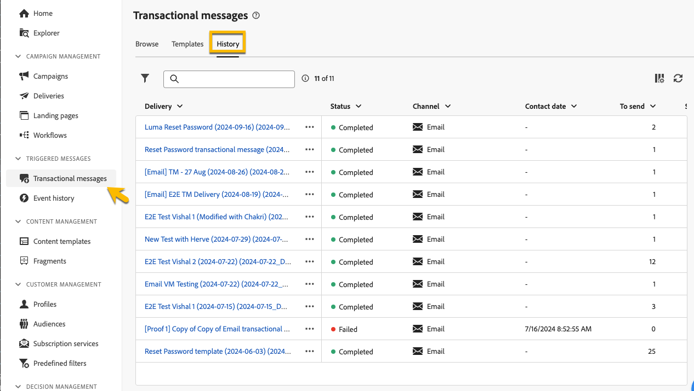

# 트랜잭션 메시지 모니터링

트랜잭션 메시지를 게시하고 보낸 후에는 이에 대한 보고와 로그를 얻을 수 있습니다.

## 트랜잭션 메시지 로그 {#transactional-logs}

메시지가 게시되면 **[!UICONTROL 로그]** 단추를 클릭하여 실행을 검토할 수 있습니다.

{zoomable="yes"}

**[!UICONTROL 로그]** 탭에서 메시지 게시에 대한 자세한 로그에 액세스할 수 있습니다.

{zoomable="yes"}

또한 해당 탭에서 로그와 함께 보낸 **[!UICONTROL 증명]** 목록을 볼 수 있습니다.

## 트랜잭션 메시지 기록 {#transactional-history}

**[!UICONTROL 트리거된 메시지]** 섹션에서 실행된 모든 트랜잭션 메시지에 대한 세부 정보를 볼 수 있습니다. 여기에 액세스하려면 **[!UICONTROL 트랜잭션 메시지]**(으)로 이동하십시오. **[!UICONTROL 기록]** 탭에서 실행된 트랜잭션 메시지 목록과 함께 상태 및 추가 정보를 볼 수 있습니다.

{zoomable="yes"}

거기서 조사를 해서 당신의 메시지를 찾고 그것을 클릭하세요.
여기에서 세부 정보를 볼 수 있습니다.

{zoomable="yes"}

## 이벤트 기록 {#event-history}

>[!CONTEXTUALHELP]
>id="acw_transacmessages_eventhistory"
>title="트랜잭션 메시지 이벤트 내역"
>abstract="트랜잭션 메시지를 트리거하는 이벤트를 볼 수 있습니다."

>[!CONTEXTUALHELP]
>id="acw_transacmessages_eventhistory_preview"
>title="트랜잭션 메시지 이벤트 내역 미리 보기"
>abstract="트랜잭션 메시지를 트리거하는 이벤트를 볼 수 있습니다."

트랜잭션 메시지를 트리거하는 이벤트를 볼 수도 있습니다.
해당 항목을 보려면 **[!UICONTROL 이벤트 기록]** 섹션으로 이동하십시오.

이벤트 유형 이름으로 볼 수 있습니다.

{zoomable="yes"}

**[!UICONTROL 이벤트]** ID를 클릭하면 아래와 같이 자세한 내용을 확인할 수 있습니다.

* 연락처 정보
* 프로세스 날짜에 대한 모든 정보

**[!UICONTROL 미리 보기]** 단추를 사용하여 보낸 메시지를 미리 보고 **[!UICONTROL 데이터 보기]** 단추를 사용하여 메시지를 트리거하는 받은 데이터를 볼 수도 있습니다.

{zoomable="yes"}

**[!UICONTROL 자세히]** 단추를 사용하면 이벤트 기록을 삭제할 수 있습니다.
