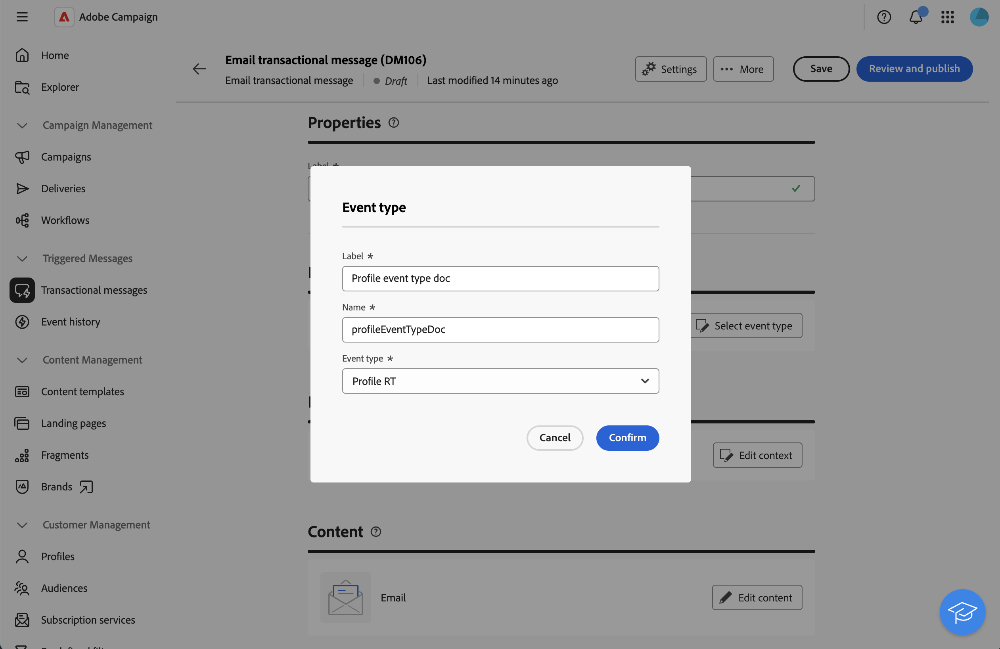

# 프로필 데이터를 사용하여 트랜잭션 메시지 강화{#profile-enrichment}

>[!AVAILABILITY]
>
>이 기능은 조직 집합(제한된 가용성)에만 사용할 수 있으며 향후 릴리스에서 전역적으로 롤아웃될 예정입니다. 서버를 8.8.2 이상으로 업그레이드해야 합니다.
>
>이 기능은 현재 이메일에서만 사용할 수 있습니다.

이 기능을 사용하면 Adobe Campaign 데이터베이스 필드를 메시지 콘텐츠에 연결하여 트랜잭션 메시지를 개인화할 수 있습니다. 대상 매핑, 데이터 보강 열 및 조정 키를 선택하여 성능 임계값을 유지하면서 정확한 실시간 개인화를 보장할 수 있습니다.

* 이벤트 기반 트랜잭션 메시지는 이벤트 자체에 포함된 데이터를 사용합니다.
* 프로필 기반 트랜잭션 메시지는 Adobe Campaign 데이터베이스에 포함된 데이터를 사용합니다.

프로필 강화를 설정하려면 다음 주요 단계를 따르십시오.

1. 트랜잭션 메시지를 만듭니다. [자세한 내용](#create-enrichment)
1. 이벤트 유형을 정의합니다. [자세히 보기](#event-enrichment)
1. 데이터 보강 설정을 설정합니다. [자세한 내용](#settings-enrichment)
1. 콘텐츠 정의, [자세히 보기](#content-enrichment)
1. 확인 및 보내기, [자세히 보기](#send-enrichment)

## 트랜잭션 메시지 만들기{#create-enrichment}

먼저 새 트랜잭션 메시지를 만들어야 합니다.

1. **[!UICONTROL 트리거된 메시지]** 섹션에서 **[!UICONTROL 트랜잭션 메시지]**(으)로 이동하여 새 트랜잭션 메시지를 만드십시오.

   {zoomable="yes"}

1. 템플릿을 선택하고 속성을 정의합니다. 자세한 정보는 이 [페이지](create-transactional.md#transactional-message)를 참조하십시오.

## 이벤트 유형 정의{#event-enrichment}

그런 다음 이벤트를 Adobe Campaign 데이터베이스에 포함된 타겟 데이터에 대한 프로필 기반으로 정의해야 합니다.

1. **이벤트 유형** 섹션에서 **이벤트 유형 선택**&#x200B;을 선택한 다음 기존 이벤트 유형을 사용하거나 직접 만드려면 선택하십시오.

   >[!NOTE]
   >
   >다른 트랜잭션 메시지 템플릿에 이미 사용된 이벤트 유형은 선택할 수 없습니다.

   {zoomable="yes"}

1. 이벤트 유형 정보를 입력합니다.

   * 기존 이벤트 유형의 경우 목록에서 선택합니다.
   * 새 레이블과 이름을 추가합니다.

1. 그런 다음 **이벤트 유형** 드롭다운에서 **프로필 RT**&#x200B;을 선택합니다.

   {zoomable="yes"}

## 데이터 보강 설정 설정{#settings-enrichment}

이제 트랜잭션 메시지를 개인화할 수 있는 필드를 이벤트에 추가하겠습니다.

1. **데이터** 섹션에서 **데이터 보강 설정**&#x200B;을 클릭합니다.

   {zoomable="yes"}

   >[!NOTE]
   >
   >이 버튼은 프로필 기반 이벤트를 정의하는 경우에만 사용할 수 있습니다.

1. **추가 특성** 섹션에서 **특성 추가**&#x200B;를 클릭하고 필요한 필드를 선택합니다.

   {zoomable="yes"}

1. 조정 키로 사용할 특성을 정의합니다.

1. 페이로드에서 키를 사용할 수 없을 경우 수행할 작업을 선택합니다.

   * 개인화 없이 메시지 전송됨
   * 메시지가 전송되지 않음

## 콘텐츠 정의{#content-enrichment}

그런 다음 트랜잭션 메시지의 콘텐츠를 정의해야 합니다.

1. **콘텐츠** 섹션에서 **콘텐츠 편집** 단추를 클릭하고 메시지 콘텐츠를 정의합니다. 이 [페이지](create-transactional.md#transactional-content)를 참조하세요.

   {zoomable="yes"}

1. 개인화를 사용하는 경우 제목 줄에서 **프로필 보강** 메뉴를 사용하여 이전에 정의한 프로필 기반 필드를 추가합니다.

   {zoomable="yes"}

## 유효성 검사 및 보내기{#send-enrichment}

마지막으로, 게재를 확인하고 전송해야 합니다.

1. 콘텐츠를 시뮬레이션하고 증명을 전송하여 게재 유효성을 확인합니다. 이 [페이지](validate-transactional.md)를 참조하세요.

1. 메시지를 만들고 게시하려면 **[!UICONTROL 검토 및 게시]** 단추를 클릭하십시오. 이제 트리거에서 트랜잭션 메시지 전송을 시작할 수 있습니다.

<!--
When creating the event configuration, select the Profile event targeting dimension (see Creating an event).

Add fields to the event, in order to be able to personalize the transactional message (see Defining the event attributes). You must add at least one field to create an enrichment. You do not need to create other fields such as First name and Last name as you will be able to use personalization fields from the Adobe Campaign database.

Create an enrichment in order to link the event to the Profile resource (see Enriching the event) and select this enrichment as the Targeting enrichment.

IMPORTANT
This step is mandatory for profile-based events.
Preview and publish the event (see Previewing and publishing the event).

When previewing the event, the REST API does not contain an attribute specifying the email address, mobile phone, or push notification specific attributes, as it will be retrieved from the Profile resource.

Once the event has been published, a transactional message linked to the new event is automatically created. In order for the event to trigger sending a transactional message, you must modify and publish the message that was just created…

Integrate the event into your website (see Integrate the event triggering).
-->

