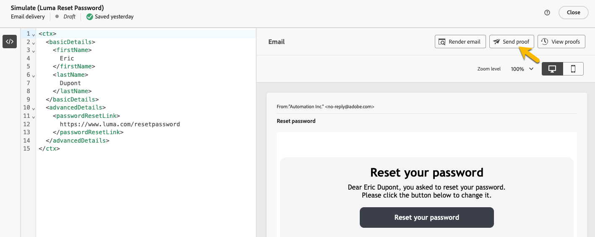

# 트랜잭션 메시지 확인

트랜잭션 메시지를 만드는 동안 또는 만든 후에 데이터 샘플을 사용하여 콘텐츠의 유효성을 검사할 수 있습니다.

## 콘텐츠 시뮬레이션 {#simulate-content}

메시지 콘텐츠를 시뮬레이션하려면 다음 단계를 따르십시오.

* 메시지 콘텐츠의 개인화 경로가 컨텍스트 샘플과 일치하는지 확인합니다. 아래 예에서 테스트 프로필의 이름을 표시하려면 *rtEvent.ctx.basicDetails.firstName* 경로를 사용하십시오.

  메시지 콘텐츠나 컨텍스트 샘플을 수정하여 정렬할 수 있습니다.

  {zoomable="yes"}

* 컨텍스트 샘플에 입력한 데이터가 포함된 트랜잭션 메시지를 미리 보려면 **[!UICONTROL 콘텐츠 시뮬레이션]** 단추를 클릭하십시오.

  {zoomable="yes"}

  콘텐츠를 검토한 후 **[!UICONTROL 닫기]** 단추를 클릭합니다.

* 콘텐츠를 변경한 경우 **[!UICONTROL 다시 게시]** 단추를 클릭해야 합니다.

## 교정쇄 보내기

이메일, SMS 또는 푸시 알림과 같이 선택한 채널을 통해 게재되는 트랜잭션 메시지를 테스트하고 경험하려면 증명 기능을 사용하십시오.

[시뮬레이션 콘텐츠 창](#simulate-content)에서 **[!UICONTROL 증명 보내기]** 단추를 클릭합니다.

{zoomable="yes"}

표시되는 새 창에서 채널에 따라 증명을 받을 이메일 주소 또는 전화 번호를 입력합니다. 원하는 주소를 입력한 후 **[!UICONTROL 증명 보내기]** 및 **[!UICONTROL 확인]** 단추를 클릭합니다. 이 작업은 트랜잭션 메시지 샘플을 전송하여 모든 개인화, 다이내믹 콘텐츠 및 서식이 최종 사용자의 경우와 마찬가지로 올바르게 표시되도록 합니다.

증명 보내기 기능 및 확인 프로세스를 보여 주는 {zoomable="yes"}

이 단계는 트랜잭션 메시지를 게시하기 전에 잠재적인 문제를 식별하는 데 필수적입니다.