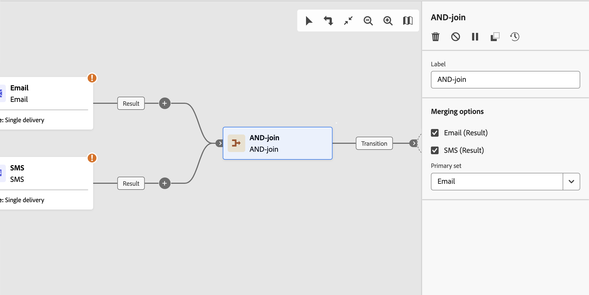

# AND-결합 {#join}

>[!CONTEXTUALHELP]
>id="acw_orchestration_and-join"
>title="AND-결합 활동"
>abstract="**AND-결합** 활동을 사용하면 워크플로의 여러 실행 분기를 동기화할 수 있습니다. 이전 활동이 모두 완료되면 트리거됩니다. 이렇게 하면 워크플로우를 계속 실행하기 전에 특정 활동이 완료됩니다."

**AND-결합** 활동은 **흐름 제어** 활동입니다. 워크플로우의 여러 실행 분기를 동기화합니다.

이 활동은 모든 인바운드 전환이 활성화된 후에만 아웃바운드 전환을 트리거합니다. 즉, 이전 활동이 모두 완료되면 활성화됩니다. 이렇게 하면 워크플로우를 계속 실행하기 전에 특정 활동이 완료됩니다.

## AND-결합 활동 구성 {#and-join-configuration}

>[!CONTEXTUALHELP]
>id="acw_orchestration_and-join_merging"
>title="병합 옵션"
>abstract="참여하고자 하는 활동을 선택합니다. **기본 세트** 드롭다운에서 유지하고자 하는 인바운드 전환 모집단을 선택합니다."

**AND-결합** 활동을 구성하려면 다음 단계를 따르십시오.

1. 채널 활동과 같은 여러 활동을 추가하여 두 개 이상의 서로 다른 실행 분기를 만듭니다.
1. 임의의 분기에 **AND-결합** 활동을 추가합니다.
1. **옵션 병합** 섹션에서 가입하려는 이전 활동을 모두 확인하십시오.
1. **기본 집합** 드롭다운에서 유지할 인바운드 전환 모집단을 선택합니다. 아웃바운드 전환에는 인바운드 전환 모집단 중 하나만 포함될 수 있습니다.

## 예제 {#and-join-example}

다음 예는 이메일 및 SMS 게재가 포함된 두 개의 워크플로 분기를 보여 줍니다. AND-join은 두 인바운드 전환이 모두 활성화된 경우 트리거됩니다. 푸시 알림은 두 게재가 모두 완료된 후에만 전송됩니다.

{zoomable="yes"}