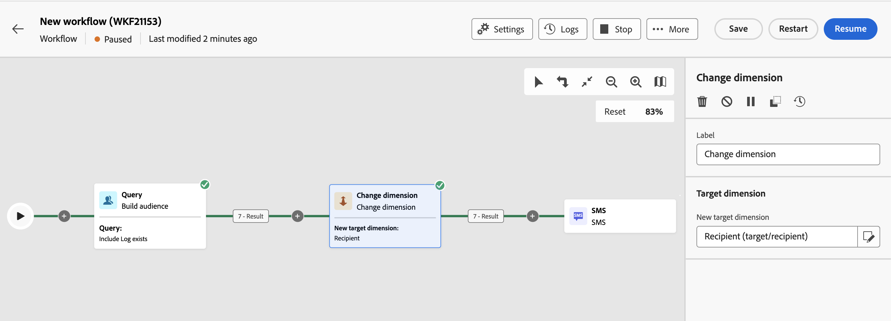

# 차원 변경 {#change-dimension}

>[!CONTEXTUALHELP]
>id="acw_orchestration_dimension_complement"
>title="보조 항목 생성"
>abstract="중복으로 제외된 나머지 모집단으로 추가 아웃바운드 전환을 생성할 수 있습니다. 이렇게 하려면 **보조 항목 생성** 옵션을 토글합니다"

>[!CONTEXTUALHELP]
>id="acw_orchestration_change_dimension"
>title="차원 활동 변경"
>abstract="이 활동을 통해 대상을 구축할 때 타겟팅 차원을 변경할 수 있습니다. 데이터 템플릿과 입력 차원에 따라 축을 이동합니다. 예를 들어 &quot;계약&quot; 차원에서 &quot;클라이언트&quot; 차원으로 전환할 수 있습니다."

다음 **차원 변경** 활동은 입니다. **타겟팅** 활동. 이 활동을 사용하면 워크플로우를 빌드할 때 타겟팅 차원을 변경할 수 있습니다. 데이터 템플릿과 입력 차원에 따라 축을 이동합니다. [타겟팅 차원에 대해 자세히 알아보기](../../audience/about-recipients.md#targeting-dimensions)

예를 들어 워크플로우의 타겟팅 차원을 &quot;수신자&quot;에서 &quot;구독자 애플리케이션&quot;으로 전환하여 타겟팅된 수신자에게 푸시 알림을 전송할 수 있습니다.

## 차원 변경 활동 구성 {#configure}

다음 단계에 따라 **차원 변경** 활동:

1. 추가 **차원 변경** 활동을 워크플로우에 추가합니다.

   

1. 다음을 정의합니다. **새 대상 차원**. 차원 변경 중에는 모든 레코드가 유지됩니다. 다른 옵션은 아직 사용할 수 없습니다.

1. 워크플로우를 실행하여 결과를 조회합니다. 차원 변경 활동 전후의 테이블에 있는 데이터를 비교하고 워크플로우 테이블의 구조를 비교합니다.

## 예제 {#example}

이 예제에서는 구매한 모든 프로필에 SMS 게재를 전송하려고 합니다. 이렇게 하려면 먼저 **[!UICONTROL 대상자 작성]** 활동은 발생한 모든 구매를 타겟팅하기 위해 사용자 지정 &quot;구매&quot; 타겟팅 차원에 연결되어 있습니다.

그런 다음 를 사용합니다. **[!UICONTROL 차원 변경]** 활동은 워크플로우 타겟팅 차원을 &quot;수신자&quot;로 전환합니다. 이를 통해 쿼리와 일치하는 수신자를 타겟팅할 수 있습니다.

