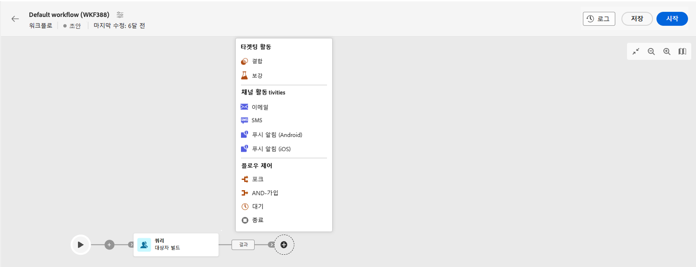

# 이메일, SMS, 푸시 활동 {#channel}

Adobe Campaign Web을 사용하여 이메일, SMS 또는 푸시 채널에서 마케팅 캠페인을 자동화하고 실행할 수 있습니다. 채널 활동을 워크플로 캔버스에 결합하여 고객 행동 및 데이터에 따라 작업을 트리거할 수 있는 크로스 채널 워크플로를 만들 수 있습니다.

예를 들어 이메일, SMS 및 푸시 등 여러 채널에서 일련의 메시지를 포함하는 시작 이메일 캠페인을 만들 수 있습니다. 고객이 구매를 완료하면 후속 이메일을 보내거나, SMS를 통해 고객에게 맞춤형 생일 메시지를 보낼 수도 있습니다.

채널 활동을 사용하여 여러 터치포인트에서 고객을 참여시키고 전환을 유도하는 포괄적인 맞춤형 캠페인을 만들 수 있습니다.

>[!NOTE]
>
>캠페인 워크플로우의 컨텍스트 외부에 일회성 게재를 만들 수도 있습니다. 다음 섹션에서 자세히 알아보기:
>* [독립 실행형 이메일 게재 만들기](../../email/create-email.md)
>* [독립 실행형 SMS 게재 만들기](../../sms/create-sms.md)
>* [독립 실행형 푸시 게재 만들기](../../push/create-push.md)

## 워크플로우 구축{#build-your-workflow}

게재를 완료하기 전에 관련 활동을 사용하여 워크플로우 작성을 시작하십시오.

* 반복 게재를 보내려면 **스케줄러** 활동. 일회성 게재를 보내려면 다음을 사용하여 연락 날짜를 정의할 수 있습니다. **스케줄러** 활동을 수행하거나 게재 설정에서 일정을 정의합니다. [이 섹션](scheduler.md)을 참조하십시오.

* 추가 **대상자 작성** 활동. 대상자는 게재의 기본 대상, 즉 메시지를 받는 수신자입니다. 캠페인 워크플로 컨텍스트에서 메시지를 전송할 때 메시지 대상자는 채널 활동에서 정의되지 않고 **대상자 빌드** 활동에서 정의됩니다. [이 섹션](build-audience.md)을 참조하십시오.

  

## 채널 활동 구성 {#create-a-delivery-in-a-workflow}

>[!CONTEXTUALHELP]
>id="acw_orchestration_email"
>title="이메일 활동"
>abstract="이메일 활동은 워크플로 내에서 이메일 전송 과정을 원활하게 하며 일회성 메시지와 반복 메시지를 모두 사용할 수 있습니다. 이는 동일한 워크플로 내에서 계산된 대상으로 이메일을 전송하는 프로세스를 자동화하는 역할을 합니다. 채널 활동을 워크플로 캔버스에 결합하여 고객 행동 및 데이터에 따라 작업을 트리거할 수 있는 크로스 채널 워크플로를 만들 수 있습니다."

>[!CONTEXTUALHELP]
>id="acw_orchestration_sms"
>title="SMS 활동"
>abstract="SMS 활동은 워크플로 내에서 SMS 전송 과정을 원활하게 하며 일회성 메시지와 반복 메시지를 모두 사용할 수 있습니다. 이는 동일한 워크플로 내에서 계산된 대상으로 SMS를 전송하는 프로세스를 자동화하는 역할을 합니다. 채널 활동을 워크플로 캔버스에 결합하여 고객 행동 및 데이터에 따라 작업을 트리거할 수 있는 크로스 채널 워크플로를 만들 수 있습니다."

>[!CONTEXTUALHELP]
>id="acw_orchestration_push_ios"
>title="푸시 iOS 활동"
>abstract="푸시 iOS 활동은 워크플로의 일부로 iOS 푸시 알림을 전송하는 프로세스를 간소화합니다. 일회성 메시지와 반복 메시지 모두를 게재할 수 있으며, 동일한 워크플로 내에서 사전 정의된 대상으로 iOS 푸시 알림을 전송하는 프로세스를 자동화합니다. 채널 활동을 워크플로 캔버스에 결합하여 고객 행동 및 데이터에 따라 작업을 트리거할 수 있는 크로스 채널 워크플로를 만들 수 있습니다."

>[!CONTEXTUALHELP]
>id="acw_orchestration_push_android"
>title="푸시 Android 활동"
>abstract="푸시 Android 활동은 워크플로의 일부로 Android 푸시 알림을 전송하는 프로세스를 간소화합니다. 일회성 메시지와 반복 메시지 모두를 게재할 수 있으며, 동일한 워크플로 내에서 사전 정의된 대상으로 Android 푸시 알림을 전송하는 프로세스를 자동화합니다. 채널 활동을 워크플로 캔버스에 결합하여 고객 행동 및 데이터에 따라 작업을 트리거할 수 있는 크로스 채널 워크플로를 만들 수 있습니다."

워크플로우 컨텍스트에서 게재를 설정하려면 아래 단계를 따르십시오.

1. 채널 활동 추가: **[!UICONTROL 이메일]**, **[!UICONTROL SMS]**, **[!UICONTROL 푸시 알림(Android)]** 또는 **[!UICONTROL 푸시 알림(iOS)]**.

1. 다음 항목 선택 **게재 유형**: 단일 또는 반복.

   * **단일 게재**: 한 번만 보내는 일회성 게재(예: 블랙 프라이데이 이메일)입니다.
   * **반복 게재**: 이 유형의 게재에서는 다음을 사용하여 실행 빈도를 설정합니다. [스케줄러 활동](scheduler.md). 워크플로우가 실행될 때마다 대상자가 다시 계산되고 업데이트된 콘텐츠와 함께 게재가 전송됩니다. 주간 뉴스레터 또는 반복 생일 이메일일 수 있습니다.

1. 게재 **템플릿** 구성을 선택합니다. 템플릿은 채널별로 미리 구성된 게재 설정입니다. 기본 제공 템플릿은 각 채널에서 사용할 수 있으며 기본적으로 미리 채워져 있습니다. [자세히 알아보기](../../msg/delivery-template.md)

   

   채널 활동 구성 왼쪽 창에서 다른 템플릿을 선택할 수 있습니다. 이전에 선택한 대상자가 채널과 호환되지 않는 경우 템플릿을 선택할 수 없습니다. 이를 해결하려면 올바른 대상 매핑으로 대상을 선택하도록 **대상자 빌드** 활동을 업데이트하십시오. 다음에서 대상 매핑에 대해 자세히 알아보기: [Adobe Campaign v8(클라이언트 콘솔) 설명서](https://experienceleague.adobe.com/docs/campaign/campaign-v8/audience/add-profiles/target-mappings.html){target="_blank"}.

1. **게재 만들기**&#x200B;를 클릭합니다. 독립 실행형 게재를 만드는 것과 같은 방식으로 메시지 설정과 콘텐츠를 정의합니다. 콘텐츠를 예약하고 시뮬레이션할 수도 있습니다. [자세히 알아보기](../../msg/gs-messages.md)

1. 워크플로우로 다시 이동합니다. 워크플로우를 계속하려면 선택하십시오. **아웃바운드 전환 생성** 채널 활동 뒤에 전환을 추가하려면

1. **시작**&#x200B;을 클릭하여 워크플로를 시작합니다.

   기본적으로 워크플로를 시작하면 메시지를 즉시 발송하지 않고 메시지 준비 단계가 트리거됩니다.

1. 게재 활동을 열고 **검토 및 전송** 버튼에서 전송을 확인합니다.

1. 게재 대시보드에서 **전송**&#x200B;을 클릭합니다.

## 예제 {#cross-channel-workflow-sample}

다음은 세분화와 두 개의 게재가 포함된 크로스 채널 워크플로의 예입니다. 해당 워크플로는 파리에 거주하며 커피 머신에 관심이 있는 모든 고객을 대상으로 합니다. 이 모집단 중 일반 고객에게는 이메일이 전송되고 VIP 클라이언트에게는 SMS가 전송됩니다.

<!--
description, which use case you can perform (common other activities that you can link before of after the activity)

how to add and configure the activity

example of a configured activity within a workflow
The Email delivery activity allows you to configure the sending an email in a workflow. 

-->

반복 워크플로우를 만들어 매월 1일 오후 8시에 파리에 거주하는 모든 고객에게 개인화된 SMS를 전송할 수도 있습니다.

<!-- Scheduled emails available?

This can be a single send email and sent just once, or it can be a recurring email.
* Single send emails are standard emails, sent once.
* Recurring emails allow you to send the same email multiple times to different targets over a defined period. You can aggregate the deliveries per period in order to get reports that correspond to your needs.

When linked to a scheduler, you can define recurring emails.
Email recipients are defined upstream of the activity in the same workflow, via an Audience targeting activity.

-->

<!--The message preparation is triggered according to the workflow execution parameters. From the message dashboard, you can select whether to request or not a manual confirmation to send the message (required by default). You can start the workflow manually or place a scheduler activity in the workflow to automate execution.-->
