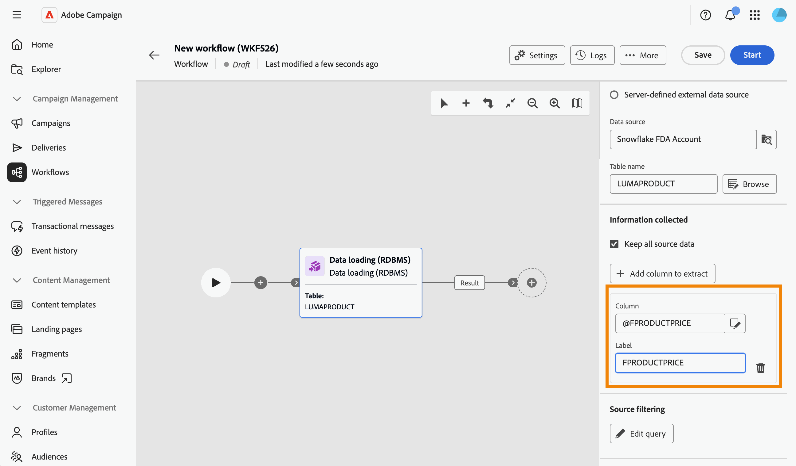
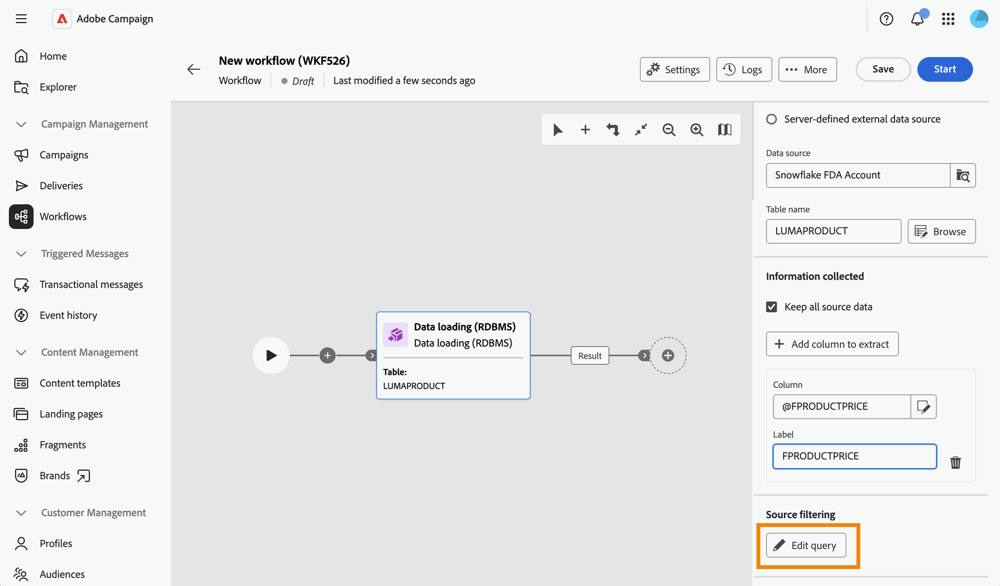

# 데이터 로딩(RDBMS) {#data-loading-rdbms}

>[!CONTEXTUALHELP]
>id="acw_orchestration_data_loading_rdbms"
>title="데이터 로드(RDBMS) 활동"
>abstract="**데이터 로드(RDBMS)** 활동은 **데이터 관리** 활동입니다. 이 활동을 사용하여 외부 관계형 데이터베이스에서 워크플로우로 직접 데이터를 로드합니다. 추출된 데이터는 워크플로 전체에서 사용 가능하며 타기팅, 보강 또는 추가 데이터 처리에 사용할 수 있습니다."

**데이터 로드(RDBMS)** 활동은 **데이터 관리** 활동입니다. 이 활동을 사용하여 외부 관계형 데이터베이스에서 워크플로우로 직접 데이터를 로드합니다. 추출된 데이터는 워크플로 전체에서 사용 가능하며 타기팅, 보강 또는 추가 데이터 처리에 사용할 수 있습니다.

<!--
This activity relies on the [Federated Data Access (FDA)](https://experienceleague.adobe.com/docs/campaign/campaign-v8/connect/fda.html){target="_blank"} option, which lets Adobe Campaign process information stored in one or more external databases without changing the structure of the Adobe Campaign data.
-->

>[!NOTE]
>
>성능을 향상시키려면 외부 데이터베이스에서 수집할 데이터의 양이 허용되면 외부 데이터와 함께 **[!UICONTROL 대상 작성]** 활동(쿼리 유형)을 대신 사용하는 것이 좋습니다.
>
>**[!UICONTROL RDBMS(데이터 로드)]** 활동은 워크플로우 분기의 첫 번째 활동이어야 합니다. 캔버스에서 다른 활동 뒤에 추가할 수 없습니다.

먼저 **RDBMS(데이터 로드)** 활동을 워크플로우 분기의 첫 번째 활동으로 추가합니다.

활동은 다음 네 개의 섹션으로 나뉩니다.

* **[!UICONTROL 대상 설정]**: 로드된 데이터가 저장되는 위치를 선택하십시오. [자세히 알아보기](#target-settings)
* **[!UICONTROL Source 설정]**: 로드할 데이터가 포함된 외부 데이터베이스에 액세스하는 방법을 선택하십시오. [자세히 알아보기](#source-settings)
* **[!UICONTROL 수집된 정보]**: 외부 테이블에서 수집되는 열을 정의합니다. [자세히 알아보기](#information-collected)
* **[!UICONTROL Source 필터링]**: 외부 테이블에서 일부 데이터만 수집하는 필터를 정의합니다. [자세히 알아보기](#filter)

마지막 두 섹션은 **[!UICONTROL Source 설정]**&#x200B;이 정의된 경우에만 나타납니다.

## 대상 설정 {#target-settings}

**[!UICONTROL Target 설정]** 섹션에서 로드된 데이터가 저장되는 위치를 선택합니다. 두 가지 옵션을 사용할 수 있습니다. **[!UICONTROL 기본 데이터 원본]** 및 **[!UICONTROL 활성 FDA 외부 계정]**.

### 기본 데이터 소스 {#default-data-source}

이 옵션은 기본적으로 선택되어 있습니다. 기본 Campaign 데이터베이스에 로드된 데이터를 저장할 수 있습니다. 옵션을 선택하면 됩니다.

### 활성 FDA 외부 계정 {#active-fda-external-account}

이 옵션을 사용하면 로드된 데이터를 외부 계정에 저장할 수 있습니다.

1. **[!UICONTROL 데이터 원본]** 필드의 오른쪽에 있는 단추를 클릭합니다.
1. 사용할 계정을 선택합니다.

   

## 소스 설정 {#source-settings}

**[!UICONTROL Source 설정]** 섹션에서 로드할 데이터가 포함된 외부 데이터베이스에 액세스하는 방법을 선택하십시오. 다음 세 가지 옵션을 사용할 수 있습니다. **[!UICONTROL 공유 외부 데이터 원본]**, **[!UICONTROL 로컬 외부 데이터 원본]** 및 **[!UICONTROL 서버 정의 외부 데이터 원본]**.

### 공유된 외부 데이터 소스 {#shared-data-source}

이 옵션은 기본적으로 선택되어 있습니다. Campaign 관리자가 이미 구성한 외부 계정을 사용할 수 있습니다. [외부 계정을 구성하는 방법을 알아봅니다](../../administration/create-external-account.md).

1. **[!UICONTROL 데이터 원본]** 필드 오른쪽에 있는 단추를 클릭하고 사용할 계정을 선택하십시오.

   

1. **[!UICONTROL 테이블 이름]** 필드 옆의 **[!UICONTROL 찾아보기]** 단추를 클릭하고 로드할 데이터가 포함된 테이블을 선택합니다.

   

### 로컬 외부 데이터 소스 {#local-external-data-source}

이 옵션을 사용하면 이 워크플로우 내에서만 일시적으로 사용할 수 있도록 활동에서 직접 외부 데이터베이스에 대한 연결을 정의할 수 있습니다. 이 연결은 외부 계정으로 저장되지 않습니다.

1. **[!UICONTROL 데이터 원본 정의]** 단추를 클릭하고 연결할 데이터베이스 엔진을 선택합니다.

   

1. 선택한 엔진에 대해 표시된 연결 필드를 채웁니다.

   

<!--
1. Click **[!UICONTROL Ok]** to confirm. The button is then relabeled **[!UICONTROL Edit data source]**, allowing you to open the dialog again to change the connection settings.
-->

1. **[!UICONTROL 테이블 이름]** 필드에 로드할 테이블 이름을 입력하십시오.

### 서버에서 정의한 외부 데이터 소스 {#server-defined-external-data-source}

이 옵션을 사용하면 서버 수준에서 이미 정의된 데이터베이스 연결을 사용할 수 있습니다.

1. **[!UICONTROL 연결 이름]** 필드에 사용할 연결 이름을 입력하십시오.
1. **[!UICONTROL 테이블 이름]** 필드에 로드할 테이블 이름을 입력하십시오.

   

## 수집된 정보 {#information-collected}

테이블이 설정되면 **[!UICONTROL 수집된 정보]** 섹션을 통해 외부 테이블에서 수집되는 열을 정의할 수 있습니다.

1. 선택한 테이블의 모든 열을 수집해야 하는 경우 **[!UICONTROL 모든 원본 데이터 보관]** 옵션(기본값)을 선택합니다.
1. 대신 또는 추가로 특정 열을 수집하려면 **[!UICONTROL 추출할 열 추가]**&#x200B;를 클릭하십시오.

   

<!--
In the **[!UICONTROL Select attribute]** dialog, scoped to the schema of the selected table, pick an attribute and confirm. [Learn how to select attributes and add them to favorites](../../get-started/attributes.md)
-->

1. 속성을 선택하고 확인합니다. 특성이 **[!UICONTROL 열]** 필드와 편집 가능한 **[!UICONTROL 레이블]** 필드가 있는 행으로 추가됩니다. 삭제 아이콘을 사용하여 제거합니다.

   

<!--
## Link to another table (optional) {#link}

NOT CONFIRMED — restore and verify before publishing.

Source: transcript of the ACC Web UI - Handsoff 12-06 demo (Herve Phulpin, ~20:49-21:04 mark). At the time of that demo, this part of the activity was explicitly described as unfinished: "the next part is not yet available", "this part is missing", "we are not able to add a link condition". No screenshot of a completed, working flow for this section has been captured since. Two related sub-bugs were still open against NEO-95826 at last check: NEO-97147 ("DBMS activity transition results not shown") and NEO-97148 ("local external data table name is not a picker").

If you need to reconcile the loaded data with an existing table, such as the Recipients table, add a link:

1. Click **Add link**.
1. Select the table to link to. You can browse tables from the Campaign database or from the external data source.
1. Define the join condition between the loaded table and the target table:
   * Simple join: Select the attributes to match between the two tables.
   * Advanced join: Use the query modeler to build the join condition.

[Learn more about link definitions in the Enrichment activity](enrichment.md#create-links).
-->

## Source 필터링(선택 사항) {#filter}

외부 테이블에서 데이터의 일부만 수집하려면 필터를 정의할 수 있습니다.

1. **[!UICONTROL Source 필터링]** 섹션에서 **[!UICONTROL 쿼리 편집]**&#x200B;을 클릭합니다.

   

1. 쿼리 모델러가 선택한 테이블의 스키마에 범위가 지정된 전용 화면에서 열립니다. 이를 사용하여 테이블의 속성에 조건을 작성합니다. [쿼리 모델러를 사용하여 작업하는 방법을 알아봅니다](../../query/query-modeler-overview.md)

   

<!--
>[!NOTE]
>
>Some advanced options available for this activity in the client console, such as computing the table name from the inbound transition, are not yet exposed in the Campaign Web User Interface.
-->