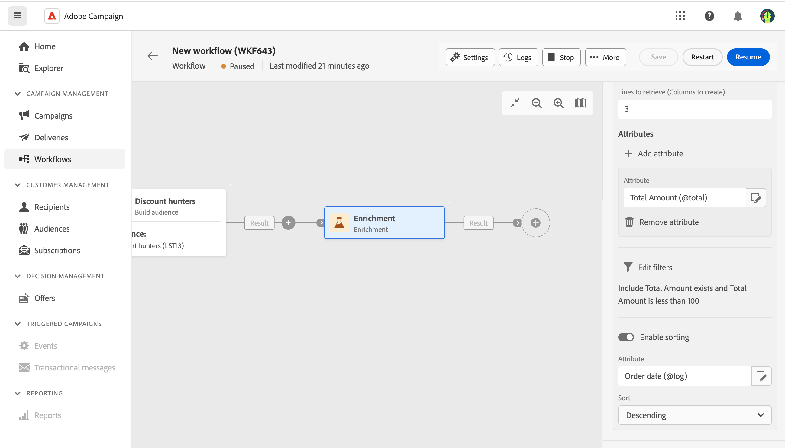

# 보강 {#enrichment}

>[!CONTEXTUALHELP]
>id="acw_orchestration_enrichment"
>title="보강 활동"
>abstract="**보강** 활동을 사용하면 데이터베이스의 추가 정보로 타겟팅된 데이터를 보강할 수 있습니다. 일반적으로 활동을 세분화한 후 워크플로에서 사용됩니다."

>[!CONTEXTUALHELP]
>id="acw_orchestration_enrichment_data"
>title="보강 활동"
>abstract="보강 데이터를 워크플로에 추가한 다음에는 이를 보강 활동 다음에 추가된 활동에서 사용하여 고객을 행동, 선호도 및 요구 사항에 따라 고유한 그룹으로 세분화하거나, 타깃 대상자의 마음을 움직일 수 있는 개인화된 마케팅 메시지 및 캠페인을 만들 수 있습니다."

>[!CONTEXTUALHELP]
>id="acw_targetdata_personalization_enrichmentdata"
>title="보강 데이터"
>abstract="워크플로를 강화하는 데 사용할 데이터를 선택합니다. 보강 데이터의 두 가지 유형, 즉 타겟팅 차원의 단일 보강 속성 또는 테이블 간에 1-N 카디널리티가 있는 링크인 컬렉션 링크를 선택할 수 있습니다."

**보강** 활동은 **타겟팅** 활동입니다. 이를 통해 데이터베이스의 추가 정보로 타겟팅된 데이터를 보강할 수 있습니다. 일반적으로 활동을 세분화한 후 워크플로에서 사용됩니다.

보강 데이터의 출처는 다음 중 하나일 수 있습니다.

* 워크플로로 타겟팅된 것과 **동일한 작업 테이블**:

  *고객 그룹 타겟팅 후 현재 작업 테이블에 “생년월일” 필드 추가*

* **다른 작업 테이블**:

  *고객 그룹 타겟팅 후 “구매” 테이블의 “수량” 및 “제품 유형” 필드 추가*

보강 데이터를 워크플로에 추가한 다음에는 이를 **보강** 활동 다음에 추가된 활동에서 사용하여 고객을 행동, 선호도 및 요구 사항에 따라 고유한 그룹으로 세분화하거나, 타겟 대상자의 마음을 움직일 수 있는 개인화된 마케팅 메시지 및 캠페인을 만들 수 있습니다.

예를 들어 고객의 구매와 관련된 워크플로 작업 테이블 정보를 추가한 다음, 이 데이터를 사용하여 해당 고객의 최근 구매 또는 이러한 구매에 지출한 금액으로 이메일을 개인화할 수 있습니다.

## 데이터 보강 활동 구성 {#enrichment-configuration}

**보강** 활동을 구성하려면 다음 단계를 따르십시오.

1. **대상자 빌드** 및 **결합** 활동과 같은 활동을 추가합니다.
1. **보강** 활동을 추가합니다.
1. **보강 데이터 추가**&#x200B;를 클릭합니다.

두 가지 유형의 보강 데이터(대상 차원의 [단일 보강 속성](#single-attribute) 또는 [컬렉션 링크](#collection-link))를 선택할 수 있습니다.

## 단일 보강 속성 {#single-attribute}

여기에서 생년월일과 같은 단일 보강 속성만 추가합니다. 다음 단계를 수행하십시오.

1. **속성** 필드 내부를 클릭합니다.
1. 타겟팅 차원에서 간단한 필드(이 예시에서는 생년월일)를 선택합니다.
1. **확인**&#x200B;을 클릭합니다.

## 컬렉션 링크 {#collection-link}

이보다 복잡한 사용 사례에서는 테이블 간에 1-N 카디널리티가 있는 링크인 컬렉션 링크를 선택합니다. 100$ 미만의 최근 구매 내역 3개를 검색해 보겠습니다. 이렇게 하려면 다음을 정의해야 합니다.

* 보강 속성: **총 금액** 필드
* 검색할 라인 수: 3
* 필터: 100$보다 큰 항목을 필터링합니다.
* 정렬: **주문 날짜** 필드에 대한 하위 정렬

### 속성 추가 {#add-attribute}

보강 데이터로 사용할 컬렉션 링크를 선택하는 곳입니다.

1. **속성** 필드 내부를 클릭합니다.
1. **고급 속성 표시**&#x200B;를 클릭합니다.
1. **구매** 테이블에서 **총 금액** 필드를 선택합니다.

### 컬렉션 설정 정의{#collection-settings}

그런 다음 데이터가 수집되는 방식과 검색할 레코드 수를 정의합니다.

1. **데이터 수집 방법 선택** 드롭다운에서 **데이터 수집**&#x200B;을 선택합니다.
1. **검색할 라인(작성할 열)** 필드에 “3”을 입력합니다.

예를 들어 고객의 평균 구매 금액을 도출하려면 대신 **집계된 데이터**&#x200B;를 선택하고 **집계 함수** 드롭다운에서 **평균**&#x200B;을 선택합니다.

### 필터 정의{#collection-filters}

여기에서 보강 속성의 최대값을 정의합니다. 100$보다 큰 항목을 필터링합니다.

1. **필터 편집**&#x200B;을 클릭합니다.
1. 두 필터(**총 금액**&#x200B;이 존재함, **총 금액**&#x200B;이 100 미만임)를 추가합니다. 첫 번째 필터는 가장 큰 값으로 표시되는 NULL 값을 필터링합니다.
1. **확인**&#x200B;을 클릭합니다.

### 정렬 정의{#collection-sorting}

이제 세 개의 **최신** 구매 항목을 검색하기 위해 정렬을 적용해야 합니다.

1. **정렬 활성화** 옵션을 활성화합니다.
1. **속성** 필드 내부를 클릭합니다.
1. **주문 날짜** 필드를 선택합니다.
1. **확인**&#x200B;을 클릭합니다.
1. **정렬** 드롭다운에서 **내림차순**&#x200B;을 선택합니다.

<!--

Add other fields
use it in delivery

cardinality between the tables (1-N)
1. select attribute to use as enrichment data

    display advanced fields option
    i button

    note: attributes from the target dimension

1. Select how the data is collected
1. number of records to retrieve if want to retrieve a collection of multiple records
1. Apply filters and build rule

    select an existing filter
    save the filter for reuse
    view results of the filter visually or in code view

1. sort records using an attribute

leverage enrichment data in campaign

where we can use the enrichment data: personalize email, other use cases?

## Example

-->
