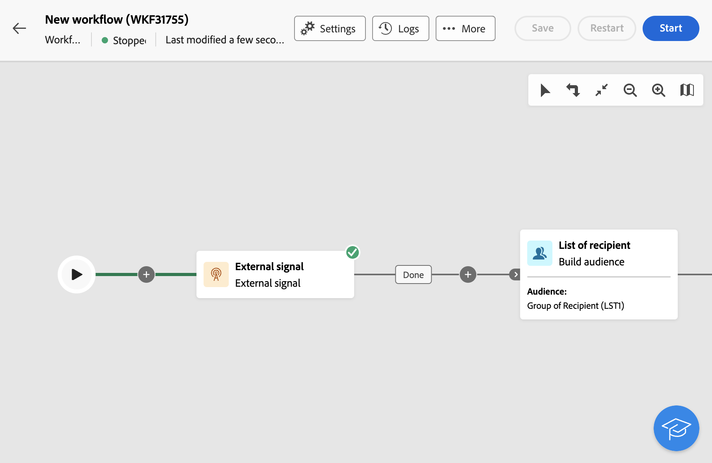

# 외부 신호 {#external-signal}

<!--External Signal End-->

>[!CONTEXTUALHELP]
>id="acw_orchestration_externalsignal"
>title="외부 신호"
>abstract="**외부 신호** 활동을 사용하면 API 호출 또는 다른 워크플로에서 워크플로의 실행을 트리거할 수 있습니다."

>[!CONTEXTUALHELP]
>id="acw_orchestration_externalsignal_parameters"
>title="외부 신호 매개변수"
>abstract="외부 신호 매개변수"

>[!CONTEXTUALHELP]
>id="acw_orchestration_end_trigger"
>title="종료 트리거"
>abstract="종료 트리거"

**외부 신호** 활동은 **흐름 제어** 활동입니다. 다른 워크플로우 또는 API 호출에서 워크플로우 실행을 트리거할 수 있습니다.

>[!NOTE]
>
>이 페이지에서는 Campaign 웹 사용자 인터페이스에서 **[!UICONTROL 외부 신호]** 활동을 구성하고 다른 워크플로우 또는 API 호출에서 트리거하는 주요 단계를 설명합니다. 워크플로우를 트리거하는 방법, 모범 사례 및 Campaign API로 작업하는 방법에 대한 자세한 내용은 [Campaign v8(클라이언트 콘솔) 설명서](https://experienceleague.adobe.com/en/docs/campaign/automation/workflows/advanced-management/javascript-in-workflows#trigger-example)를 참조하세요.

**외부 신호** 활동을 구성하고 실행을 트리거하려면 다음 단계를 따르십시오.

1. 워크플로우에 **외부 신호** 활동을 추가합니다.

1. 워크플로우의 구성을 완료하고 실행을 시작합니다. **[!UICONTROL 외부 신호]** 활동이 &quot;보류 중&quot;으로 표시되어 트리거되기를 기다립니다.

   

1. 다음 정보를 검색합니다.

   * 레이블 옆에 표시되는 **워크플로의 내부 이름**&#x200B;입니다.

     +++보기 예

     

     +++

   * 워크플로우의 **[!UICONTROL 실행 옵션]**&#x200B;에 표시되는 **외부 신호 활동의 이름**&#x200B;입니다.

     +++보기 예

     

     +++

1. 워크플로우를 트리거하려면 `PostEvent` JavaScript 함수를 실행합니다. 이 함수를 사용하면 선택한 값으로 변수를 전달하고 트리거된 워크플로우에서 사용할 수 있습니다.

   `PostEvent` 함수는 다른 워크플로우 또는 API 호출에서 실행할 수 있습니다.

   * 워크플로우에서 **[!UICONTROL 외부 신호]** 활동을 트리거하려면 활동의 **[!UICONTROL 실행 옵션]**&#x200B;에서 액세스할 수 있는 **[!UICONTROL 초기화 스크립트]** 창에서 PostEvent 함수를 실행하십시오. **[!UICONTROL JavaScript 코드]** 활동의 경우 해당 활동의 스크립트에서 함수를 실행하십시오.

     구문은 다음과 같습니다.

     ```
     xtk.workflow.PostEvent("<workflow-internal-name>","<signal-activity-name>","",<variables <variable-name>="<value>"/>, false);
     ```

   +++보기 예

   이 예에서는 &quot;signal1&quot; 외부 신호 활동이 트리거됩니다. 내부 이름이 &quot;WKF12345&quot;인 워크플로우에 추가되었습니다. 이름이 &quot;customID&quot;인 변수가 &quot;123456&quot; 값과 함께 전달됩니다.

   

   +++

   * API 호출에서 **[!UICONTROL 외부 신호]** 활동을 트리거하려면 Campaign API 설명서에 설명된 단계를 따르십시오. [정적 `PostEvent` 메서드를 사용하는 방법을 알아봅니다](https://experienceleague.adobe.com/developer/campaign-api/api/sm-workflow-PostEvent.html).