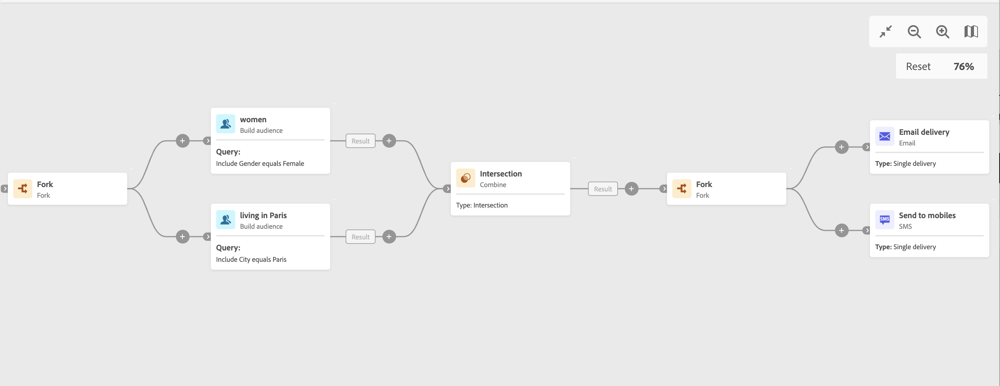

# 포크 {#fork}

>[!CONTEXTUALHELP]
>id="acw_orchestration_fork"
>title="포크 활동"
>abstract="**포크** 활동을 사용하면 아웃바운드 전환을 만들어서 여러 활동을 동시에 시작할 수 있습니다."

>[!CONTEXTUALHELP]
>id="acw_orchestration_fork_transitions"
>title="포크 활동 전환"
>abstract="기본적으로 **포크** 활동을 통해 두 개의 전환을 만듭니다. **전환 추가** 버튼을 클릭하여 추가 아웃바운드 전환을 정의하고 해당 레이블을 입력합니다."

**포크** 활동은 **플로우 제어** 활동입니다. 아웃바운드 전환을 만들어서 여러 활동을 동시에 시작할 수 있습니다.

**분기 추가**(**+**) 도구 모음 단추를 사용하여 별도의 분기를 만들 수도 있습니다. [활동 오케스트레이션](../orchestrate-activities.md#toolbar)을 참조하세요.

## 포크 활동 구성 {#fork-configuration}

**포크** 활동을 구성하려면 다음 단계를 따르십시오.

1. **포크** 활동을 워크플로에 추가합니다.
1. 새 아웃바운드 전환을 추가하려면 **전환 추가**&#x200B;를 클릭합니다. 기본적으로 두 개의 전환이 정의됩니다.
1. 각 전환에 레이블을 추가합니다.

## 예제 {#fork-example}

다음 예제에서는 두 개의 **Fork** 활동이 사용됩니다.

* 두 쿼리 앞에 한 개 추가하여 동시에 실행합니다.
* 교차 후 타겟팅된 모집단에 이메일과 SMS를 동시에 보낼 수 있습니다.

