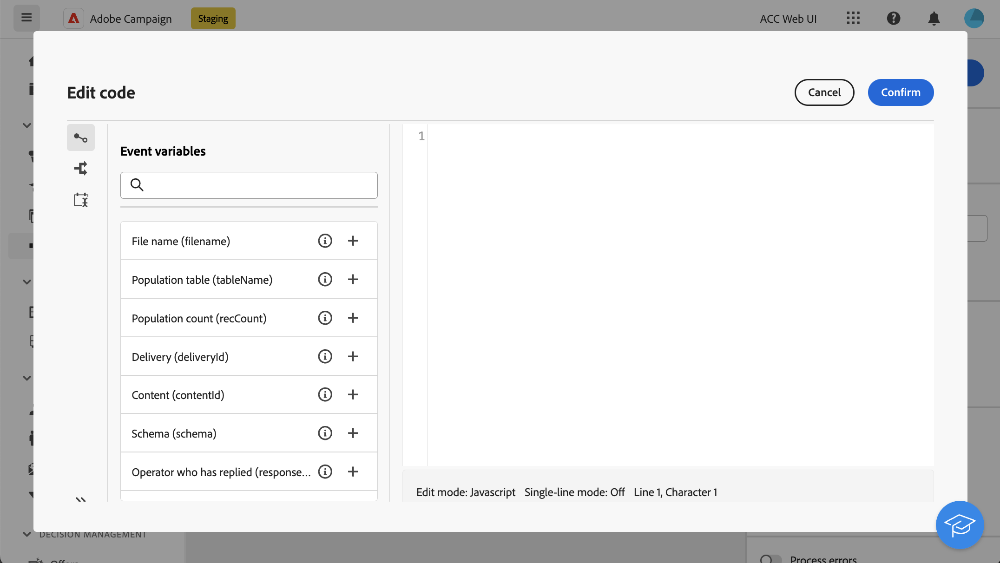
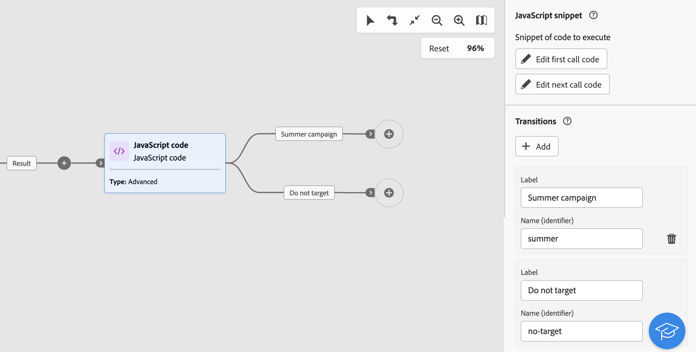

# JavaScript 코드 {#javascript-code}

>[!CONTEXTUALHELP]
>id="acw_orchestration_javascript"
>title="JavaScript 코드"
>abstract="다음 **JavaScript 코드** 활동을 사용하면 워크플로우 컨텍스트에서 JavaScript 스크립트를 실행할 수 있습니다. 이렇게 하면 작업을 수행하거나 데이터베이스에서 정보를 수집할 수 있습니다. 사용 **단순** 워크플로우 실행 시 하나의 코드 조각을 실행하는 JavaScript 코드 활동. **고급** Javascript 코드 활동을 사용하면 두 개의 서로 다른 코드 조각을 순차적 순서로 실행하여 보다 복잡한 작업을 수행할 수 있습니다. 워크플로우가 처음 시작되면 첫 번째 호출이 실행됩니다. 워크플로우가 다시 실행될 때마다 두 번째 호출에 정의된 코드가 실행됩니다."

>[!CONTEXTUALHELP]
>id="acw_orchestration_javascript_snippet"
>title="JavaScript 코드 조각"
>abstract="활동을 실행할 때 실행할 스크립트를 정의합니다. 다음을 구성하는 경우 **고급** JavaScript 활동에서는 두 개의 코드 조각(워크플로우의 첫 번째 실행 시 실행할 첫 번째 호출 코드 및 워크플로우의 다음 호출 시 실행할 다음 호출 코드)을 편집해야 합니다."

>[!CONTEXTUALHELP]
>id="acw_orchestration_javascript_execution"
>title="JavaScript 실행"
>abstract="실행 기간 후에 활동을 중지하도록 실행 지연을 구성합니다. 기본적으로 실행 단계는 1시간을 초과할 수 없습니다. 이 지연 후에는 오류 메시지와 함께 프로세스가 중단되고 활동 실행이 실패합니다. 이 제한을 무시하려면 값을 0으로 설정하십시오."

>[!CONTEXTUALHELP]
>id="acw_orchestration_javascript_transition"
>title="JavaScript 전환"
>abstract="여러 출력 전환을 추가하려면 **[!UICONTROL 전환 추가]** 단추를 클릭합니다. 예를 들어 JavaScript 코드 활동에 정의된 특정 조건을 기반으로 특정 전환을 트리거할 수 있습니다. 이 옵션은 다음 경우에 사용할 수 있습니다. **고급** JavaScript 코드 활동만 해당됩니다."

다음 **JavaScript 코드** 활동은 입니다. **데이터 관리** 활동. 이 활동을 사용하여 워크플로우 컨텍스트에서 JavaScript 스크립트를 실행합니다. 이렇게 하면 데이터베이스에서 정보를 수집하거나 다른 복잡한 작업을 수행할 수 있습니다.

## JavaScript 코드 활동 구성 {#javascript-code-configuration}

다음 단계에 따라 **JavaScript 코드** 활동:

1. 추가 **JavaScript 코드** 활동을 워크플로우에 추가합니다.

1. 만들려는 활동 유형을 선택합니다.

   * **단순**: 코드 조각 하나를 실행합니다.
   * **고급**: 이 옵션을 사용하면 두 개의 다른 코드 조각을 실행하여 고급 작업을 수행할 수 있습니다. [고급 JavaScript 활동을 구성하는 방법 알아보기](#advanced)

   >[!NOTE]
   >
   >Campaign 웹 사용자 인터페이스를 사용하여 두 활동을 병합하여 하나로 통합했습니다 **단순** 및 **고급** JavaScript 코드 기능. 이 통합은 어떤 식으로든 활동의 기능에 영향을 주지 않습니다.

1. 을(를) 확인하고 **[!UICONTROL 코드 편집]** 단추를 클릭하여 표현식 편집기를 엽니다. 왼쪽 창에는 이벤트 변수를 포함하여 코드를 작성하는 데 활용할 수 있는 사전 정의된 구문이 제공됩니다. [이벤트 변수 및 표현식 편집기를 사용하여 작업하는 방법을 알아봅니다](../event-variables.md)

   

1. 다음에서 **[!UICONTROL 실행]** 섹션에서 실행 기간 후에 활동을 중지하도록 지연을 구성합니다. 기본적으로 실행 단계는 1시간을 초과할 수 없습니다. 이 지연 후에는 오류 메시지와 함께 프로세스가 중단되고 활동 실행이 실패합니다. 이 제한을 무시하려면 값을 0으로 설정하십시오.

   

1. 전환 **[!UICONTROL 프로세스 오류]** 추가 출력 전환에서 스크립트 실행 중에 발생하는 오류를 유지하는 옵션입니다.

## 고급 JavaScript 코드 활동 {#advanced}

고급 JavaScript 활동을 사용하면 복잡한 작업을 수행할 수 있습니다. 이를 통해 다음을 수행할 수 있습니다.

* 두 개의 다른 코드 조각을 실행합니다. 워크플로우가 처음 시작될 때 첫 번째 코드 조각이 실행됩니다. 워크플로우가 다시 실행될 때마다 두 번째 호출에 정의된 코드 조각이 실행됩니다.
* 스크립트를 사용하여 동적으로 상호 작용할 수 있는 여러 출력 전환을 추가합니다.

고급 JavaScript 코드 활동을 구성하려면 다음 단계를 수행하십시오.

1. 다음 항목 선택 **고급** 을 입력한 다음 실행할 코드 조각을 구성합니다.

   * 클릭 **[!UICONTROL 첫 번째 호출 코드 편집]** 첫 번째 호출 동안 실행할 스크립트를 정의합니다.
   * 클릭 **[!UICONTROL 다음 호출 코드 편집]** 워크플로우의 다음 호출 동안 실행할 스크립트를 정의합니다. (선택 사항)

1. 하나 이상의 출력 전환을 추가하려면 **[!UICONTROL 전환 추가]** 단추를 클릭하고 각 전환에 대한 레이블과 내부 이름을 지정합니다.

   이 예제에서는 특정 조건을 기반으로 코드 조각의 스크립트에 의해 활성화되는 두 개의 전환을 구성했습니다.

   

1. 활동 구성을 완료하고 워크플로우를 시작합니다.

## 예제 {#javascript-code-example}

### 들어오는 모집단을 기반으로 변수 초기화 {#example1}

이 예에서는 워크플로우에서 타겟팅한 프로필 수에 따라 변수를 초기화하는 방법을 보여 줍니다.


여기에서는 데이터베이스의 VIP 프로필을 타겟팅합니다. 대상자 작성 활동으로 타겟팅된 프로필 수에 따라 달라지는 값으로 &quot;channel&quot;이라는 변수를 생성하려고 합니다.

* 1000개 이상의 프로필이 타겟팅되면 &quot;email&quot; 값으로 변수를 초기화합니다.
* 그렇지 않으면 값 &quot;sms&quot;로 초기화하십시오.

이렇게 하려면 다음 단계를 수행합니다.

1. 추가 **JavaScript 코드** 유형이 있는 활동 **단순** 다음 이후 **대상자 작성** 활동.

1. 클릭 **코드 편집** 코드 조각을 다음과 같이 구성합니다.

   ```
   if (vars.recCount > 1000)
       vars.channel ="email"
   else
       vars.channel = "sms"
   ```

1. 워크플로우를 시작합니다. 채널 변수는 의 타겟팅 프로필 수에 따라 &quot;email&quot; 또는 &quot;sms&quot; 값으로 만들어집니다. **대상자 작성** 활동.

### 변수 값을 기반으로 전환 트리거 {#example2}

이 예에서는 변수 값을 기반으로 전환을 트리거하는 방법을 보여 줍니다.


여기에서 워크플로는 다음으로 시작됩니다. **외부 신호** 활동. 변수(`interest`)가 다른 워크플로우에서 전달됩니다. 변수의 값은 초기 워크플로우에서 수행되는 필터링 작업에 따라 &quot;실행 중&quot; 또는 &quot;요가&quot;입니다.

변수의 값을 기반으로 워크플로우에서 다른 전환을 트리거하려고 합니다.

이렇게 하려면 다음 단계를 수행합니다.

1. 추가 **JavaScript 코드** 유형의 외부 신호 활동 이후 활동 **고급**.

1. 가능한 각 변수 값(&quot;실행 중&quot;, &quot;요가&quot;)에 대해 하나씩, 두 개의 전환을 추가합니다.

1. 클릭 **첫 번째 호출 코드 편집** 코드 조각을 다음과 같이 구성합니다.

   ```
   if (vars.interest=="running")
       task.postEvent(task.transitionByName("running"));
   else
       task.postEvent(task.transitionByName("yoga"));
   ```

1. 필요에 따라 각 전환의 구성을 완료한 다음 워크플로우를 시작합니다. 의 값을 기반으로 두 출력 전환 중 하나가 활성화됩니다. `interest` 을(를) 통해 전달된 변수 **외부 신호** 활동.
