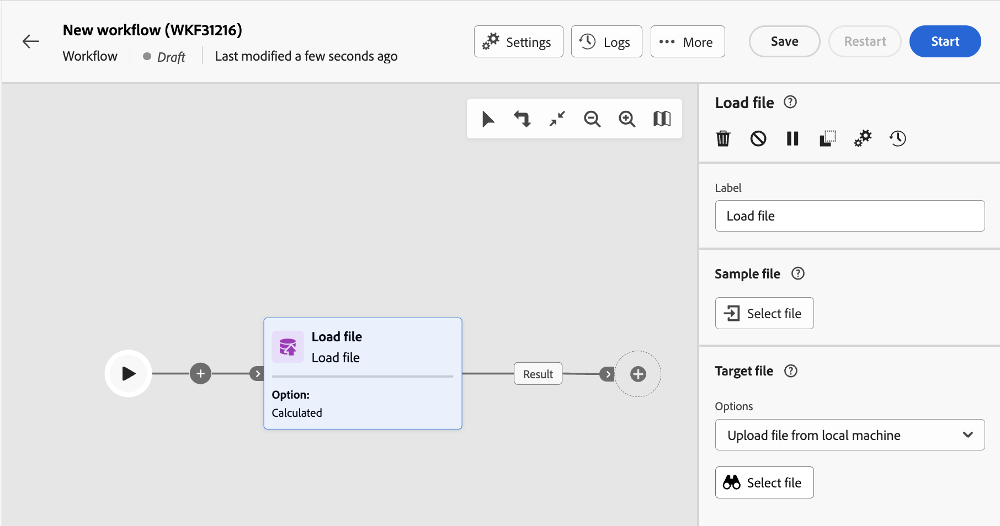

# 파일 로드 {#load-file}

>[!CONTEXTUALHELP]
>id="acw_orchestration_loadfile"
>title="파일 로드 활동"
>abstract="**파일 로드** 활동은 **데이터 관리** 활동입니다. 이 활동을 사용하여 외부 파일에 저장된 데이터로 작업합니다. 프로필 및 데이터는 데이터베이스에 추가되지 않지만 입력 파일의 모든 필드는 개인화하거나 프로필 또는 다른 테이블을 업데이트하는 데 사용할 수 있습니다. "

>[!CONTEXTUALHELP]
>id="acw_orchestration_loadfile_outboundtransition"
>title="관리 아웃바운드 전환 거부"
>abstract="관리 아웃바운드 전환 거부"

>[!CONTEXTUALHELP]
>id="acw_orchestration_loadfile_outboundtransition_reject"
>title="거부에 대한 관리 아웃바운드 전환 거부"
>abstract="거부에 대한 관리 아웃바운드 전환 거부"

**파일 로드** 활동은 **데이터 관리** 활동입니다. 이 활동을 사용하여 외부 파일에 저장된 프로필 및 데이터를 사용합니다. 프로필 및 데이터는 데이터베이스에 추가되지 않지만 입력 파일의 모든 필드는 다음에 사용할 수 있습니다. [개인화](../../personalization/gs-personalization.md)또는 를 사용하여 프로필 또는 기타 테이블을 업데이트할 수 있습니다.

>[!NOTE]
>지원되는 파일 형식은 텍스트(TXT) 및 쉼표로 구분된 값(CSV)입니다. 최대 크기가 50MB인 파일을 로드할 수 있습니다.

이 활동은 다음에서 사용할 수 있습니다. [조정](reconciliation.md) 활동을 통해 미식별 데이터를 기존 리소스에 연결할 수 있습니다. 예를 들어 **파일 로드** 활동은 다음에 배치할 수 있습니다. **조정** 활동(비표준 데이터를 데이터베이스로 가져오는 경우)

## 파일 로드 활동 구성 {#load-configuration}

다음 **파일 로드** 활동 구성에는 두 단계가 포함됩니다. 먼저 샘플 파일을 업로드하여 예상 파일 구조를 정의해야 합니다. 이 작업이 완료되면 데이터를 가져올 파일의 출처를 지정할 수 있습니다. 활동을 구성하려면 아래 단계를 따르십시오.

### 샘플 파일 구성 {#sample}

>[!CONTEXTUALHELP]
>id="acw_orchestration_loadfile_samplefile"
>title="샘플 파일"
>abstract="샘플 파일을 업로드하여 예상 파일 구조를 선택합니다."

>[!CONTEXTUALHELP]
>id="acw_orchestration_loadfile_formatting"
>title="파일 로드 활동에 대한 서식 지정"
>abstract="다음에서 **서식** 섹션에서 데이터를 올바르게 가져오는지 확인하기 위해 파일의 형식을 지정하는 방법을 지정합니다."

>[!CONTEXTUALHELP]
>id="acw_orchestration_loadfile_valueremapping"
>title="파일 로드 활동에 대한 값 재매핑"
>abstract="이 옵션을 사용하여 로드된 파일의 특정 값을 새 값으로 매핑합니다. 예를 들어 열에 &quot;True&quot;/&quot;False&quot; 값이 포함된 경우 매핑을 추가하여 해당 값을 자동으로 &quot;0&quot;/&quot;1&quot; 문자로 바꿀 수 있습니다."

예상 파일 구조를 정의하는 데 사용되는 샘플 파일을 구성하려면 다음 단계를 따르십시오.

1. 추가 **파일 로드** 활동을 워크플로우에 추가합니다.

1. 예상 파일 구조를 정의하는 데 사용할 샘플 파일을 선택합니다. 이렇게 하려면 **파일 선택** 의 단추 **[!UICONTROL 샘플 파일]** 을(를) 섹션에서 선택하고 사용할 로컬 파일을 선택합니다.

   >[!NOTE]
   >
   >샘플 파일의 데이터는 활동 구성에 사용하지만 가져오지는 않습니다. 데이터가 적은 샘플 파일을 사용하는 것이 좋습니다. 파일 형식은 다음과 일치해야 합니다. [샘플 파일](../../audience/file-audience.md#sample-file).

1. 샘플 파일의 미리 보기가 표시되며 최대 30개의 줄이 표시됩니다.

1. 다음에서 **[!UICONTROL 파일 유형]** 드롭다운 목록에서 파일이 구분된 열 또는 고정 너비 열을 사용하는지 여부를 지정합니다.

   

1. 구분된 열 파일 형식의 경우 **열** 섹션을 통해 각 열의 속성을 구성할 수 있습니다.

   +++파일 열에 사용 가능한 옵션

   * **[!UICONTROL 레이블]**: 열에 대해 표시할 레이블입니다.
   * **[!UICONTROL 데이터 유형]**: 열에 포함된 데이터 유형입니다.
   * **[!UICONTROL 폭]** (문자열 데이터 유형): 열에 표시할 최대 문자 수입니다.
   * **[!UICONTROL 데이터 변환]** (문자열 데이터 유형): 열에 포함된 값에 변환을 적용합니다.
   * **[!UICONTROL 공백 관리]** (문자열 데이터 형식): 열에 포함된 공백을 관리하는 방법을 지정합니다.
   * **[!UICONTROL 구분 기호]** (날짜, 시간, 정수 및 숫자 데이터 형식)*: 구분 기호로 사용할 문자를 지정합니다.
   * **[!UICONTROL NULL 허용]**: 열에서 빈 값을 관리하는 방법을 지정합니다. 빈 값이 있으면 &quot;Adobe Campaign 기본값&quot; 옵션에서 오류가 발생합니다.
   * **[!UICONTROL 오류 처리 중]** (문자열 데이터 유형): 라인 중 하나에서 오류가 발생하는 경우 동작을 지정합니다.
   * **[!UICONTROL 값 재매핑]**: 이 옵션을 사용하면 특정 값을 새 값과 매핑할 수 있습니다. 예를 들어 열에 &quot;True&quot;/&quot;False&quot; 값이 포함된 경우 매핑을 추가하여 해당 값을 자동으로 &quot;0&quot;/&quot;1&quot; 문자로 바꿀 수 있습니다.

+++

1. 다음에서 **서식** 섹션에서 데이터를 올바르게 가져오는지 확인하기 위해 파일의 형식을 지정하는 방법을 지정합니다.

### 업로드할 대상 파일 정의 {#target}

>[!CONTEXTUALHELP]
>id="acw_orchestration_loadfile_targetfile"
>title="파일 로드 활동에 대한 대상 파일"
>abstract="다음에서 **[!UICONTROL 대상 파일]** 섹션에서 서버에 업로드할 파일을 검색하는 방법을 지정합니다."

>[!CONTEXTUALHELP]
>id="acw_orchestration_loadfile_nameofthefile"
>title="파일 이름"
>abstract="서버에 업로드할 필드의 이름을 지정합니다. 다음을 클릭합니다. **[!UICONTROL 개인화 대화 상자 열기]** ( 이벤트 변수를 포함한 표현식 편집기를 활용하여 파일 이름을 계산하는 아이콘)"

>[!CONTEXTUALHELP]
>id="acw_orchestration_loadfile_targetdb"
>title="Target 데이터베이스"
>abstract="에 액세스하는 경우 **[!UICONTROL 파일 로드]** 활동은 클라이언트 콘솔에서 이미 설정되어 있습니다. **[!UICONTROL 대상 데이터베이스]** 섹션은 파일을 외부 데이터베이스에 업로드하도록 활동을 구성한 경우에 사용할 수 있습니다."

>[!CONTEXTUALHELP]
>id="acw_orchestration_loadfile_command"
>title="파일 로드 명령"
>abstract="사전 처리를 위해 임의 명령을 허용하는 것은 보안과 관련된 문제이므로 보안 옵션인 XtkSecurity_Disable_Preproc을 비활성화하여 사전 정의된 명령 목록을 강제로 사용하도록 하십시오."

>[!CAUTION]
>
>대상 파일을 로드하기 전에 해당 파일이 샘플 파일 형식을 준수하는지 확인하십시오. 파일 형식, 열 구조 또는 열 수가 일치하지 않으면 워크플로우 실행 중에 오류가 발생할 수 있습니다.

업로드할 대상 파일을 정의하려면 다음 단계를 수행합니다.

1. 다음에서 **[!UICONTROL 대상 파일]** 섹션에서 서버에 업로드할 파일을 검색할 때 수행할 작업을 지정합니다.

   * **[!UICONTROL 로컬 컴퓨터에서 파일 업로드]**: 컴퓨터에서 업로드할 파일을 선택합니다.

   * **[!UICONTROL 전환에 지정됨]**: 다음과 같은 이전 활동에서 예정된 인바운드 전환에 지정된 파일을 업로드합니다. **[!UICONTROL 파일 전송]**.

   * **[!UICONTROL 파일 사전 처리]**: 이전 전환에 지정된 파일을 업로드하고 다음과 같은 전처리 명령을 적용합니다. **[!UICONTROL 압축 풀기]** 또는 **[!UICONTROL 암호 해독]**.

   * **[!UICONTROL 계산됨]**: 다음에서 이름이 지정된 파일을 업로드합니다. **[!UICONTROL 파일 이름]** 필드. 다음을 클릭합니다. **[!UICONTROL 개인화 대화 상자 열기]** ( 이벤트 변수를 포함한 표현식 편집기를 활용하여 파일 이름을 계산하는 아이콘)

   

   >[!NOTE]
   >
   >에 액세스하는 경우 **[!UICONTROL 파일 로드]** 활동은 클라이언트 콘솔에서 이미 설정되어 있습니다. **[!UICONTROL 대상 데이터베이스]** 섹션은 파일을 외부 데이터베이스에 업로드하도록 활동을 구성한 경우에 표시됩니다. 파일을 Campaign 서버에 업로드할지 외부 데이터베이스에 업로드할지를 지정할 수 있습니다.

### 추가 옵션 {#options}

>[!CONTEXTUALHELP]
>id="acw_orchestration_loadfile_rejectmgt"
>title="파일 로드 활동에 대한 관리 거부"
>abstract="다음에서 **관리 거부** 섹션에서 오류 발생 시 활동이 어떻게 동작해야 하는지 지정합니다. 허용할 최대 오류 수를 정의하고 **[!UICONTROL 파일에 거부 유지]** 가져올 때 발생한 오류가 포함된 파일을 서버에 다운로드하는 옵션입니다."

>[!CONTEXTUALHELP]
>id="acw_orchestration_loadfile_delete"
>title="가져오기 후 파일 삭제"
>abstract="파일을 가져온 후 서버에서 원본 파일을 삭제하려면 **가져오기 후 파일 삭제**&#x200B;를 토글하십시오."

1. 다음에서 **관리 거부** 섹션에서 오류 발생 시 활동이 어떻게 동작해야 하는지 지정합니다.

   * 다음에서 **[!UICONTROL Dele]** 필드에서는 로드할 파일을 처리할 때 권한이 부여된 최대 오류 수를 지정합니다. 예를 들어 이 값을 &quot;20&quot;으로 설정하면 파일을 로드할 때 20개가 넘는 오류가 있는 경우 워크플로우 실행이 실패합니다.

   * 파일을 로드할 때 발생한 오류를 유지하려면 **[!UICONTROL 파일에 거부 유지]** 옵션을 켜고 파일에서 원하는 이름을 지정합니다. **[!UICONTROL 거부 파일]** 필드.

     이 옵션을 활성화하면 활동 뒤에 &quot;Complement&quot;라는 추가 출력 전환이 추가됩니다. 가져오는 동안 발생하는 모든 오류는 서버의 지정된 파일에 저장됩니다.

1. 워크플로우를 실행한 후 서버에서 업로드한 파일을 삭제하려면 **[!UICONTROL 가져오기 후 파일 삭제]** 옵션을 선택합니다.

   

1. 설정이 적절하면 **확인**&#x200B;을 클릭합니다.

## 예제 {#load-example}

와 함께 사용되는 외부 파일 로드 샘플 **조정** 활동은에서 사용할 수 있습니다. [이 섹션](reconciliation.md#reconciliation-example).
