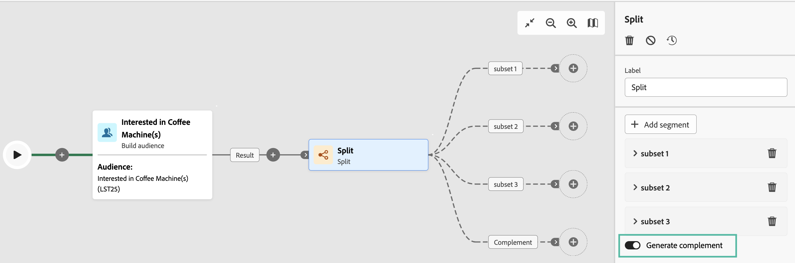

# 분할 {#split}

>[!CONTEXTUALHELP]
>id="acw_orchestration_split"
>title="분할 활동"
>abstract="다음 **분할** 활동을 사용하면 필터링 규칙 또는 모집단 크기와 같은 다양한 선택 기준에 따라 들어오는 모집단을 여러 하위 집합으로 세그먼트화할 수 있습니다."

**분할** 활동은 필터링 규칙 또는 모집단 크기와 같은 다양한 선택 기준에 따라 수신 모집단을 여러 하위 집합으로 세그먼트화할 수 있는 **타겟팅** 활동입니다.

## 분할 활동 구성 {#split-configuration}

>[!CONTEXTUALHELP]
>id="acw_orchestration_split_filter"
>title="활동 필터 분할"
>abstract="하위 집합에 필터링 조건을 적용하려면 **[!UICONTROL 필터 만들기]**&#x200B;를 클릭하고 원하는 필터링 조건을 구성합니다. 예를 들어 데이터베이스에 이메일 주소가 존재하는 수신 모집단의 프로필을 포함합니다."

>[!CONTEXTUALHELP]
>id="acw_orchestration_split_limit"
>title="활동 제한 분할"
>abstract="하위 집합에서 선택한 프로필 수를 제한하려면 **[!UICONTROL 제한 활성화]** 옵션을 토글하고 포함할 모집단의 수 또는 백분율을 지정합니다."

>[!CONTEXTUALHELP]
>id="acw_orchestration_split_sorting"
>title="활동 분할 정렬"
>abstract="하위 집합에 대해 모집단 제한을 설정할 때 특정 프로필 속성을 기준으로 선택한 프로필의 등급을 오름차순 또는 내림차순으로 지정할 수 있습니다. 이렇게 하려면 **정렬 활성화** 옵션을 토글합니다. 예를 들어 구매 금액이 가장 높은 상위 50개 프로필만 포함하도록 하위 집합을 제한할 수 있습니다."

**분할** 활동을 구성하려면 다음 단계를 따르십시오.

1. **분할** 활동을 워크플로에 추가합니다.

1. 활동 구성 창이 기본 하위 집합과 함께 열립니다. 수신 모집단을 세그먼트화하기 위해 원하는 만큼 하위 집합을 추가하려면 **세그먼트 추가** 버튼을 클릭합니다.

   

   >[!IMPORTANT]
   >
   >분할 활동이 실행되면 모집단이 활동에 추가된 순서대로 여러 하위 집합에 걸쳐 세그먼트화됩니다. 예를 들어 첫 번째 하위 집합이 초기 모집단의 70%를 복구하는 경우 다음으로 추가된 하위 집합은 나머지 30%에만 선택 기준을 적용하는 식입니다.
   >
   > 위치를 변경할 수 없으므로 하위 집합을 구성하기 전에 올바른 순서로 추가했는지 확인하십시오.

1. 하위 집합이 추가되면 해당 활동은 하위 집합만큼이 출력 전환을 표시합니다. 워크플로 캔버스에서 쉽게 식별할 수 있도록 각 하위 집합의 레이블을 변경하는 것이 좋습니다.

1. 각 하위 집합이 수신 모집단을 필터링하는 방법을 구성합니다. 이렇게 하려면 다음 단계를 수행합니다.

   1. 하위 집합을 열어 해당 속성을 표시합니다.

   1. 하위 집합에 필터링 조건을 적용하려면 **[!UICONTROL 필터 만들기]**&#x200B;를 클릭하고 원하는 필터링 조건을 구성합니다. 예를 들어 데이터베이스에 이메일 주소가 존재하는 수신 모집단의 프로필을 포함합니다.

   1. 하위 집합에서 선택한 프로필 수를 제한하려면 **[!UICONTROL 제한 활성화]** 옵션을 토글하고 포함할 모집단의 수 또는 백분율을 지정합니다.

      

      >[!NOTE]
      >
      >하위 집합에 대해 모집단 제한을 설정할 때 특정 프로필 속성을 기준으로 선택한 프로필의 등급을 오름차순 또는 내림차순으로 지정할 수 있습니다. 이렇게 하려면 **[!UICONTROL 정렬 활성화]** 옵션을 토글합니다. 예를 들어 구매 금액이 가장 높은 상위 50개 프로필만 포함하도록 하위 집합을 제한할 수 있습니다.

1. 모든 하위 집합을 구성한 후에는 하위 집합과 일치하지 않는 나머지 모집단을 선택하여 추가 아웃바운드 전환에 포함할 수 있습니다. 이렇게 하려면 **[!UICONTROL 보조 항목 생성]** 옵션을 토글합니다.

   

이제 활동이 구성되었습니다. 워크플로 실행 시 모집단은 활동에 추가된 순서대로 여러 하위 집합으로 세그먼트화됩니다.

## 예제{#split-example}

다음 예에서는 **[!UICONTROL 분할]** 활동을 통해 사용하려는 커뮤니케이션 채널을 기반으로 대상자를 별개의 하위 집합으로 세그먼트화합니다.

* **하위 집합 1 “푸시”**: 이 하위 집합은 모바일 애플리케이션을 설치한 모든 프로필로 구성됩니다.
* **하위 집합 2 “SMS”**: 휴대폰 사용자: 하위 집합 1에 속하지 않은 나머지 모집단에 대해 하위 집합 2는 필터링 규칙을 적용하여 데이터베이스에서 휴대폰이 있는 프로필을 선택합니다.
* **보조 항목 전환**: 이 전환은 하위 집합 1 또는 하위 집합 2와 일치하지 않는 나머지 모든 프로필을 캡처합니다. 특히 모바일 앱을 설치하지 않았거나 등록된 휴대폰 번호가 없는 사용자 등, 모바일 애플리케이션을 설치하지 않았거나 휴대폰이 없는 사용자의 프로필이 포함됩니다.

