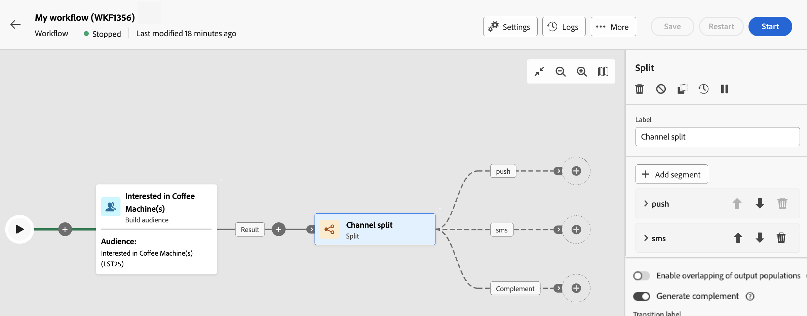

# 분할 {#split}

다음 **분할** 활동은 입니다. **타겟팅** 활동을 사용하면 필터링 규칙 또는 모집단 크기와 같은 다양한 선택 기준에 따라 들어오는 모집단을 여러 하위 집합으로 세그먼트화할 수 있습니다.

## 구성 {#general}

다음 단계에 따라 **분할** 활동:

1. 추가 **분할** 활동을 워크플로우에 추가합니다.

1. 활동 구성 창이 기본 하위 집합으로 열립니다. 다음을 클릭합니다. **세그먼트 추가** 단추를 사용하여 원하는 만큼 하위 집합을 추가하여 들어오는 모집단을 세그먼트화합니다.

   

   >[!IMPORTANT]
   >
   >분할 활동이 실행되면 모집단은 활동에 추가된 순서로 서로 다른 하위 집합에 대해 분할됩니다. 예를 들어 첫 번째 하위 집합이 초기 모집단의 70%를 복구하는 경우, 추가된 다음 하위 집합은 나머지 30%에만 선택 기준을 적용합니다.
   >
   > 하위 집합을 구성하기 전에 해당 위치를 변경할 수 없으므로 올바른 순서로 추가했는지 확인하십시오.

1. 하위 집합이 추가되면, 활동에 하위 집합 수만큼 출력 전환이 표시됩니다. 워크플로우 캔버스에서 각 하위 집합의 레이블을 쉽게 식별하기 위해 레이블을 변경하는 것을 강력히 명령합니다.

1. 각 하위 집합이 들어오는 모집단을 필터링하는 방법을 구성합니다. 이렇게 하려면 다음 단계를 수행합니다.

   1. 하위 집합을 열어 해당 속성을 표시합니다.

   1. 필터링 조건을 하위 집합에 적용하려면 다음을 클릭하십시오. **[!UICONTROL 필터 만들기]** 원하는 필터링 규칙을 구성합니다. 예를 들어 데이터베이스에 이메일 주소가 있는 수신 모집단의 프로필을 포함합니다.

   1. 하위 집합에서 선택한 프로필 수를 제한하려면 **[!UICONTROL 제한 활성화]** 옵션을 선택하고 포함할 모집단의 수나 백분율을 지정합니다.

      >[!NOTE]
      >
      >하위 집합에 대한 모집단 제한을 설정할 때 특정 프로필 속성에 따라 선택한 프로필의 등급을 오름차순 또는 내림차순으로 지정할 수 있습니다. 이렇게 하려면 **[!UICONTROL 정렬 활성화]** 옵션을 선택합니다. 예를 들어 구매 금액이 가장 큰 상위 50개 프로필만 포함하도록 하위 집합을 제한할 수 있습니다.

   

1. 모든 하위 집합을 구성했으면 하위 집합과 일치하지 않는 나머지 모집단을 선택하여 추가 아웃바운드 전환에 포함할 수 있습니다. 이렇게 하려면 **[!UICONTROL 보조 항목 생성]** 옵션을 선택합니다.

   

이제 활동이 구성되었습니다. 워크플로우 실행 시 모집단은 활동에 추가된 순서대로 다른 하위 집합으로 분할됩니다.

## 예제

다음 예제에서는 **[!UICONTROL 분할]** 활동은 사용하려는 통신 채널을 기반으로 대상을 개별 하위 집합으로 분할하는 데 사용됩니다.

* **하위 집합 1 &quot;푸시&quot;**: 이 하위 집합은 모바일 애플리케이션을 설치한 모든 프로필로 구성됩니다.
* **하위 집합 2 &quot;sms&quot;**: 휴대폰 사용자: 하위 집합 1에 해당하지 않는 나머지 모집단의 경우, 하위 집합 2는 필터링 규칙을 적용하여 데이터베이스에서 휴대폰이 있는 프로필을 선택합니다.
* **보체 전이**: 이 전환은 하위 집합 1 또는 하위 집합 2와 일치하지 않는 나머지 모든 프로필을 캡처합니다. 구체적으로 모바일 앱을 설치하지 않았거나 등록된 휴대전화 번호가 없는 사용자 등 모바일 애플리케이션을 설치하지 않았거나 휴대폰이 없는 프로필이 포함됩니다.

