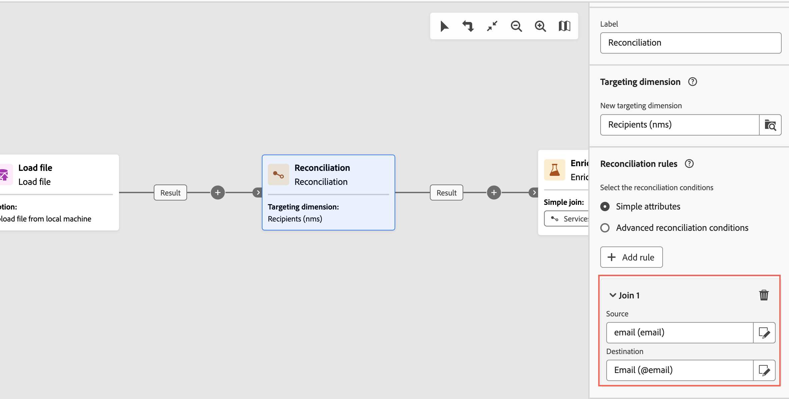

# 구독 서비스 {#subscription-services}

>[!CONTEXTUALHELP]
>id="acw_orchestration_subscription"
>title="구독 서비스 활동"
>abstract="구독 서비스 활동을 통해 한 번의 작업으로 여러 프로필을 서비스에 구독하거나 구독을 취소할 수 있습니다."

>[!CONTEXTUALHELP]
>id="acw_orchestration_subscription_general"
>title="구독 서비스 일반 매개변수"
>abstract="원하는 서비스를 선택하고 수행할 작업(구독 또는 구독 취소)을 선택합니다. **확인 메시지 보내기** 옵션을 전환하여 선택한 서비스에서 구독하거나 구독이 취소되었음을 모집단에 알립니다."

>[!CONTEXTUALHELP]
>id="acw_orchestration_subscription_outboundtransition"
>title="아웃바운드 전환 생성"
>abstract="**아웃바운드 전환 생성** 옵션을 토글하여 활동 뒤에 전환을 추가합니다."

>[!CONTEXTUALHELP]
>id="acw_orchestration_subscription_additionalinfo"
>title="추가 정보"
>abstract="각 레코드에 대한 구독의 데이터와 원본을 지정합니다. 이 섹션을 비워두면 워크플로를 실행할 때 날짜나 원본이 설정되지 않습니다. 인바운드 데이터에 프로필의 서비스 구독 날짜를 나타내는 열이 포함된 경우 **[!UICONTROL 날짜]** 필드에서 선택할 수 있습니다. **[!UICONTROL 원본 경로]** 필드에서 구독의 원본을 정의합니다. **[!UICONTROL 상수를 원본으로 설정]** 옵션을 확인하여 인바운드 데이터의 필드 중 하나 또는 선택한 상수 값으로 설정할 수 있습니다."

**구독 서비스** 활동은 **데이터 관리** 활동입니다. 전환에 지정된 모집단에 대한 정보 서비스 구독을 만들거나 삭제할 수 있습니다.

## 구독 서비스 활동 구성 {#subscription-services-configuration}

**구독 서비스** 활동을 구성하려면 다음 단계를 따르십시오.

1. 워크플로우에 **구독 서비스** 활동을 추가합니다. 프로필을 타겟팅하거나 식별된 데이터가 있는 파일을 가져온 후 이 활동을 사용할 수 있습니다.

1. 다음 옵션 중 하나를 사용하여 구독을 관리할 서비스를 선택합니다.

   * **[!UICONTROL 특정 서비스를 선택하십시오]**: **[!UICONTROL 서비스]** 필드를 사용하여 서비스를 수동으로 선택하십시오.

   * **[!UICONTROL 인바운드 전환에서]**: 인바운드 전환에서 지정된 서비스를 사용합니다. 예를 들어 각 행에 대해 관리할 서비스를 지정하는 파일을 가져올 수 있습니다. 그런 다음 각 프로필에 대해 작업을 수행할 서비스가 동적으로 선택됩니다.

   

1. 수행할 작업을 선택하십시오. **구독** 또는 **구독 취소**.

   서비스가 인바운드 전환에서 정의된 경우 이 작업을 검색하는 방법을 선택합니다.

   * **특정 작업 유형 선택**: 수행할 작업을 수동으로 선택합니다(**구독** 또는 **구독 취소**).

   * **인바운드 전환의 경로에서 작업 형식을 선택하십시오**: 각 레코드에 대해 수행할 작업을 지정하는 인바운드 데이터의 열을 선택하십시오. 예를 들어 &quot;작업&quot; 열의 각 행에 대해 수행할 작업을 지정하는 파일을 가져올 수 있습니다.

     여기에서는 부울 또는 정수 필드만 선택할 수 있습니다. 수행할 작업이 포함된 데이터가 이 형식과 일치하는지 확인합니다. 예를 들어 파일 로드 활동에서 데이터를 로드하는 경우 **[!UICONTROL 파일 로드]** 활동에서 작업이 포함된 열의 형식을 올바르게 설정했는지 확인합니다. 예제는 [이 섹션](#uc2)에 나와 있습니다.

     >[!CAUTION]
     >
     >기본적으로 이 옵션을 선택하면 **구독 서비스** 활동에서 워크플로우에 설정된 **서비스(nms)** 테이블에 대한 링크 정의를 사용합니다. 이렇게 하려면 워크플로우의 이전 **데이터 보강 활동**&#x200B;에서 조정 링크를 구성했는지 확인하십시오. 이 옵션을 사용하는 방법을 보여 주는 예는 [여기](#uc2)에서 확인할 수 있습니다.

   

1. 수신자에게 선택한 서비스를 구독하거나 구독 취소했음을 알리려면 **[!UICONTROL 확인 메시지 보내기]** 옵션을 켜세요. 이 알림의 콘텐츠는 정보 서비스와 연결된 게재 템플릿에 정의됩니다.

1. 인바운드 전환의 데이터를 사용하는 경우 각 레코드에 대한 데이터 및 구독 출처를 지정할 수 있는 **[!UICONTROL 추가 정보]** 섹션이 표시됩니다. 이 섹션을 비워 둘 수 있습니다. 이 경우 워크플로우를 실행할 때 날짜 또는 출처가 설정되지 않습니다.

   * 인바운드 데이터에 프로필의 서비스 구독 날짜를 나타내는 열이 포함된 경우 **[!UICONTROL 날짜]** 필드에서 선택할 수 있습니다.

   * **[!UICONTROL 원본 경로]** 필드에서 구독의 원본을 정의합니다. **[!UICONTROL 상수를 원본으로 설정]** 옵션을 확인하여 인바운드 데이터의 필드 중 하나 또는 선택한 상수 값으로 설정할 수 있습니다.

   

1. 활동 뒤에 아웃바운드 전환을 추가하려면 **[!UICONTROL 아웃바운드 전환 생성]** 옵션을 켜십시오.

## 예제 {#example}

### 특정 서비스에 대상자 가입 {#uc1}

아래의 이 워크플로우는 대상자를 기존 서비스에 구독하는 방법을 보여 줍니다.

특정 서비스에 대상자를 구독하는 워크플로의 

* **[!UICONTROL 대상자 작성]** 활동은 기존 대상자를 타깃팅합니다.

* **[!UICONTROL 구독 서비스]** 활동을 통해 프로필을 구독해야 하는 서비스를 선택할 수 있습니다.

### 파일에서 여러 구독 상태 업데이트 {#uc2}

아래 워크플로에서는 프로필이 포함된 파일을 가져오고 파일에 지정된 여러 서비스에 대한 구독을 업데이트하는 방법을 보여 줍니다.

파일에서 여러 구독 상태를 업데이트하는 워크플로우의 

* **[!UICONTROL 파일 로드]** 활동은 데이터가 포함된 CSV 파일을 로드하고 가져온 열의 구조를 정의합니다. &quot;서비스&quot; 및 &quot;작업&quot; 열은 업데이트할 서비스와 수행할 작업(구독 또는 구독 취소)을 지정합니다.

  ```
  Lastname,firstname,city,birthdate,email,service,operation
  Smith,Hayden,Paris,23/05/1985,hayden.smith@example.com,yoga,sub
  Mars,Daniel,London,17/11/1999,danny.mars@example.com,running,sub
  Smith,Clara,Roma,08/02/1979,clara.smith@example.com,running,unsub
  Durance,Allison,San Francisco,15/12/2000,allison.durance@example.com,yoga,sub
  Durance,Alison,San Francisco,15/12/2000,allison.durance@example.com,running,unsub
  ```

  아시다시피, 작업은 파일에 &quot;구독&quot; 또는 &quot;구독 취소&quot;로 지정되어 있습니다. 시스템은 **부울** 또는 **정수** 값으로 수행할 작업을 인식합니다. &quot;0&quot;은 구독을 취소하고, &quot;1&quot;은 구독합니다. 이 요구 사항과 일치시키려면
   * &quot;operation&quot; 열의 **데이터 형식**&#x200B;이(가) 정수로 설정되어 있습니다.
   * &quot;sub&quot; 및 &quot;unsub&quot; 값을 &quot;1&quot; 및 &quot;0&quot; 값과 일치시키려면 **값 다시 매핑**&#x200B;을 수행해야 합니다.

  

  파일이 이미 &quot;0&quot; 및 &quot;1&quot;을 사용하여 작업을 식별하는 경우 해당 값을 다시 매핑할 필요가 없습니다. 열이 샘플 파일 열에서 **부울** 또는 **정수**(으)로 처리되었는지 확인하기만 하면 됩니다.

* **[!UICONTROL 조정]** 활동은 파일의 데이터를 Adobe Campaign 데이터베이스의 프로필 차원에 속하는 것으로 식별합니다. 파일의 **전자 메일** 필드가 프로필 리소스의 **전자 메일** 필드와 일치합니다.

  

* **[!UICONTROL 데이터 보강]** 활동은 업로드된 파일의 &quot;service&quot; 열과 데이터베이스의 &quot;internal name&quot; 필드 사이에 간단한 조인을 사용하여 &quot;Services(nms)&quot; 테이블에 대한 조정 링크를 만듭니다.

  

* **[!UICONTROL 구독 서비스]**&#x200B;는 업데이트할 서비스를 전환에서 나온 것으로 식별합니다.

  **[!UICONTROL 작업 형식]**&#x200B;이(가) 파일의 **작업** 필드에서 나온 것으로 식별되었습니다. 여기에서는 부울 또는 정수 필드만 선택할 수 있습니다. 수행할 작업이 포함된 파일의 열이 목록에 표시되지 않으면 이 예제의 앞부분에서 설명한 대로 **[!UICONTROL 파일 로드]** 활동에서 열 형식을 올바르게 설정했는지 확인하십시오.

  