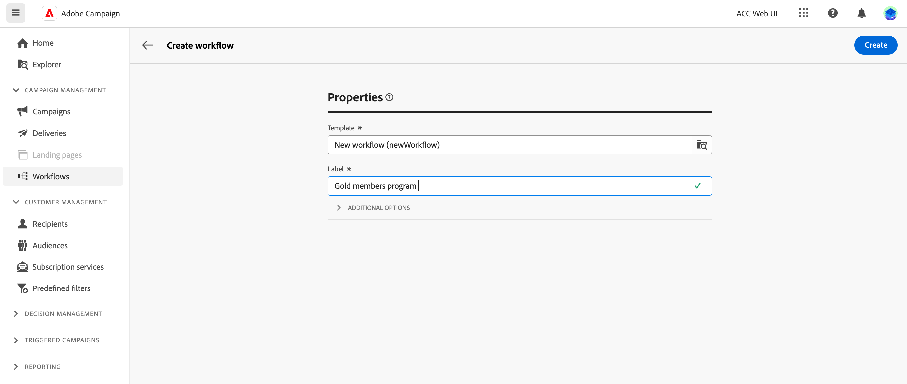
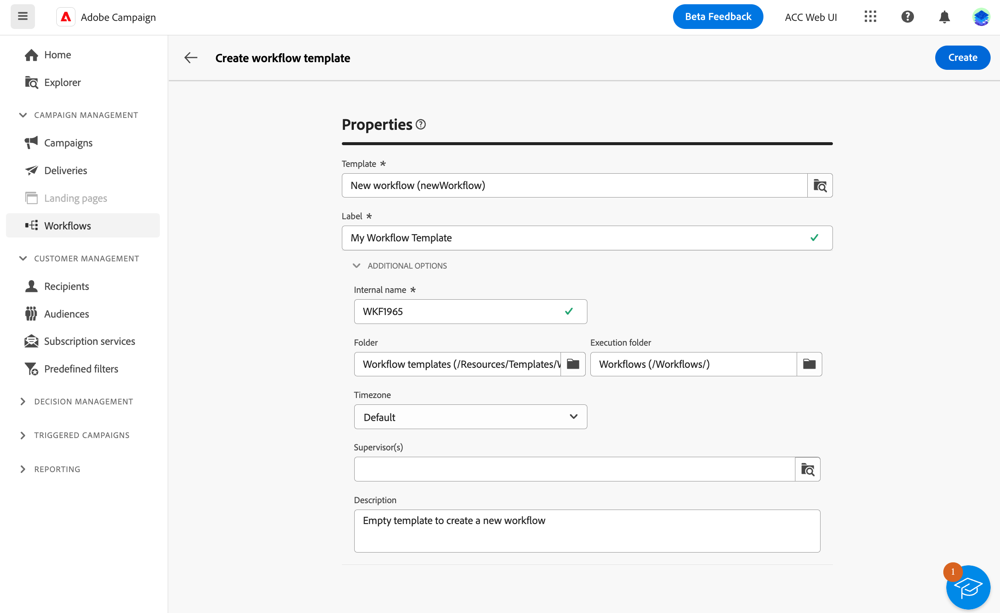

# 워크플로 만들기 {#create-first-workflow}

>[!CONTEXTUALHELP]
>id="acw_workflow_creation_properties"
>title="워크플로 속성"
>abstract="이 화면에서 워크플로를 만들고 레이블을 지정하는 데 사용할 템플릿을 선택합니다. 추가 옵션 섹션을 확장하여 워크플로우 내부 이름, 해당 폴더, 시간대, 감독자 그룹 등의 추가적인 설정을 구성합니다. 오류가 발생할 경우 운영자에게 경고할 수 있도록 감독자 그룹을 선택하는 것을 권장하여 드립니다."

>[!CONTEXTUALHELP]
>id="acw_campaign_creation_workflow"
>title="캠페인의 워크플로 목록"
>abstract="다음 **게재** 탭에는 현재 캠페인에 연결된 모든 워크플로우가 나열됩니다. 편집할 워크플로의 이름을 클릭합니다. 워크플로우 만들기 버튼을 사용하여 이 캠페인에 대한 새 워크플로우를 추가합니다."

독립 실행형 워크플로우 또는 캠페인 내에서 워크플로우를 만들 수 있습니다. 첫 번째 단계는 템플릿을 선택하고 일반 속성을 정의하는 것입니다. 그런 다음 필요에 따라 추가 설정을 구성할 수 있습니다.

이렇게 하려면 다음 단계를 수행합니다.

1. 을(를) 만들려면 **독립 실행형 워크플로**&#x200B;로 이동하여 **워크플로우** 메뉴 아래의 제품에서 사용할 수 있습니다.

   을(를) 만들려면 **캠페인 워크플로우**&#x200B;로 이동하여 **캠페인** 새 워크플로우를 만들 캠페인을 엽니다.

1. 다음을 클릭합니다. **[!UICONTROL 워크플로우 만들기]** 화면의 오른쪽 상단에 있는 단추입니다.

   

1. 워크플로우 내 **속성** 대화 상자에서 워크플로를 만드는 데 사용할 템플릿을 선택합니다(기본 내장 템플릿을 사용할 수도 있음). 의 템플릿에 대해 자세히 알아보기 [아래 섹션](#work-with-workflow-templates-workflow-templates).

1. 워크플로우의 레이블을 입력합니다. 또한 워크플로우의 전용 필드에 설명을 추가하는 것이 좋습니다. **[!UICONTROL 추가 옵션]** 섹션에 있는 마지막 항목이 될 필요가 없습니다.

1. 확장 **[!UICONTROL 추가 옵션]** 섹션에 자세히 설명되어 있습니다. 에서 워크플로우 속성을 구성하는 방법을 알아봅니다. [이 페이지](workflow-settings.md#properties)

   

1. 다음을 클릭합니다. **[!UICONTROL 워크플로우 만들기]** 단추를 클릭하여 워크플로우 만들기를 확인합니다.

이제 워크플로우가 생성되어 워크플로우 목록에서 사용할 수 있습니다. 이제 해당 시각적 캔버스에 액세스하여 수행할 작업을 추가, 구성 및 오케스트레이션할 수 있습니다. 에서 워크플로우 활동을 오케스트레이션하는 방법을 알아봅니다 [이 페이지](orchestrate-activities.md).

## 워크플로우 템플릿 작업 {#workflow-templates}

>[!CONTEXTUALHELP]
>id="acw_workflow_template_for_campaign"
>title="워크플로 템플릿"
>abstract="워크플로우 템플릿에는 사전 구성된 설정 및 새 워크플로우를 만드는 데 다시 사용할 수 있는 활동이 포함되어 있습니다."

워크플로우 템플릿에는 사전 구성된 설정 및 새 워크플로우를 만드는 데 다시 사용할 수 있는 활동이 포함되어 있습니다. 워크플로우를 만들 때 워크플로우 속성에서 워크플로우의 템플릿을 선택할 수 있습니다. 기본적으로 빈 템플릿이 제공됩니다.

기존 워크플로우에서 템플릿을 만들거나 새 템플릿을 처음부터 만들 수 있습니다. 두 방법 모두 아래에 자세히 설명되어 있습니다.

>[!BEGINTABS]

>[!TAB 기존 워크플로우에서 템플릿 만들기]

기존 워크플로우에서 워크플로우 템플릿을 만들려면 다음 단계를 수행합니다.

1. 에 열기 **워크플로** 메뉴를 클릭하고 워크플로우를 찾아 템플릿으로 저장합니다.
1. 워크플로의 이름 오른쪽에 있는 세 점을 클릭하고 을(를) 선택합니다 **템플릿으로 복사**.

   

1. 팝업 창에서 템플릿 만들기를 확인합니다.
1. 워크플로 템플릿 캔버스에서 필요에 따라 활동을 선택, 추가 및 구성합니다.
1. 에서 설정을 찾아봅니다. **설정** 워크플로 템플릿의 이름을 변경하고 설명을 입력합니다.
1. 다음 항목 선택 **폴더** 및 **실행 폴더** 템플릿의 일부입니다. 폴더는 워크플로 템플릿이 저장되는 위치입니다. 실행 폴더는 이 템플릿을 기반으로 만든 워크플로우가 저장되는 폴더입니다.

   

   다른 속성은 워크플로와 공통됩니다. [이 페이지](workflow-settings.md#properties)에서 자세히 알아보기

1. 변경 내용을 저장합니다.

이제 템플릿 목록에서 워크플로 템플릿을 사용할 수 있습니다. 이 템플릿을 기반으로 워크플로우를 만들 수 있습니다. 이 워크플로우는 템플릿에 정의된 설정 및 활동으로 사전 구성됩니다.

>[!TAB 처음부터 템플릿 만들기]

워크플로 템플릿을 처음부터 만들려면 다음 단계를 수행하십시오.

1. 에 열기 **워크플로** 메뉴 아래의 **템플릿** 탭. 사용 가능한 워크플로우 템플릿 목록을 볼 수 있습니다.
1. 다음을 클릭합니다. **[!UICONTROL 템플릿 만들기]** 화면의 오른쪽 상단에 있는 단추입니다.
1. 레이블을 입력하고 추가 옵션을 열어 워크플로 템플릿에 대한 설명을 입력합니다.
1. 템플릿의 폴더 및 실행 폴더를 선택합니다. 폴더는 워크플로 템플릿이 저장되는 위치입니다. 실행 폴더는 이 템플릿을 기반으로 만든 워크플로우가 저장되는 폴더입니다.

   

   다른 속성은 워크플로와 공통됩니다. [이 페이지](workflow-settings.md#properties)에서 자세히 알아보기

1. 다음을 클릭합니다. **만들기** 단추를 클릭하여 설정을 확인합니다.
1. 워크플로 템플릿 캔버스에서 필요에 따라 활동을 추가하고 구성합니다.

   

1. 변경 내용을 저장합니다.

이제 템플릿 목록에서 워크플로 템플릿을 사용할 수 있습니다. 이 템플릿을 기반으로 워크플로우를 만들 수 있습니다. 이 워크플로우는 템플릿에 정의된 설정 및 활동으로 사전 구성됩니다.

>[!ENDTABS]
