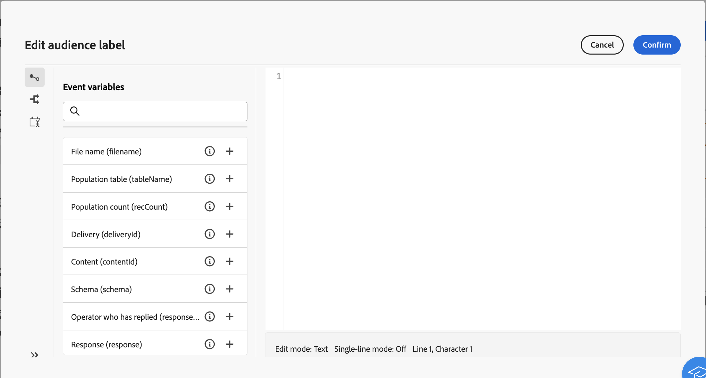

# 워크플로 이벤트 변수 {#event-variables}

일부 워크플로우 활동을 사용하면 표현식 편집기에서 스크립트를 편집하여 이전 활동에서 얻은 데이터 검색, 조건 작성 또는 이벤트 변수를 기반으로 파일 이름 계산과 같은 특정 작업을 수행할 수 있습니다.

## 이벤트 변수 소개 {#scripting}

워크플로우 컨텍스트에서 실행되는 스크립트는 일련의 추가 전역 액세스 **오브젝트** 실행 중인 워크플로우 자체(`ìnstance`), 다양한 작업(`task`), 아니면 지정된 작업을 활성화한 이벤트(`event`).

의 각 유형으로 **오브젝트** 은(는) 의 범주와 연결되어 있습니다. **변수** 다음과 같은 활동에서 스크립트를 편집할 때 표현식 편집기에서 활용할 수 있습니다. **[!UICONTROL JavaScript 코드]** 또는 **[!UICONTROL 테스트]**.

* **인스턴스 변수** (`instance.vars.xxx`)은 글로벌 변수와 비슷합니다. 모든 활동에서 공유됩니다.
* **작업 변수** (`task.vars.xxx`)는 로컬 변수와 비슷합니다. 현재 작업에서만 사용됩니다. 이러한 변수는 데이터를 유지하기 위해 영구적인 활동에서 사용되며 경우에 따라 동일한 활동의 여러 스크립트 간에 데이터를 교환하는 데 사용됩니다.
* **이벤트 변수** (`vars.xxx`) 워크플로우 프로세스의 기본 작업 간에 데이터 교환을 활성화합니다. 진행 중인 작업을 활성화한 작업에 의해 이러한 변수가 전달됩니다. 그런 다음 다음 다음 활동으로 전달됩니다. **이벤트 변수** 는 가장 자주 사용되는 변수이며 인스턴스 변수보다 우선하여 사용해야 합니다.

>[!NOTE]
>
>Adobe Campaign의 스크립팅 및 노출된 개체 및 변수에 대한 추가 정보는 Campaign v8(클라이언트 콘솔) 설명서에서 확인할 수 있습니다 [이 섹션](https://experienceleague.adobe.com/en/docs/campaign/automation/workflows/advanced-management/javascript-scripts-and-templates).
>
>이 리소스는 중요한 통찰력을 제공하지만 Campaign 웹 사용자 인터페이스가 아닌 클라이언트 콘솔에 구체적으로 적용되므로 불일치가 존재할 수 있습니다.

## 표현식 편집기에서 이벤트 변수 활용 {#expression-editor}

미리 정의된 이벤트 변수는 표현식 편집기 왼쪽 창에서 사용할 수 있습니다. 코드에서 새 변수를 초기화하여 새 변수를 만들 수도 있습니다.

이러한 이벤트 변수 외에도 다음을 활용할 수도 있습니다. **[!UICONTROL 조건]** 왼쪽 창에 있는 메뉴로 조건 및 **[!UICONTROL 현재 날짜 추가]** 날짜 형식과 관련된 함수를 사용하는 메뉴입니다.
