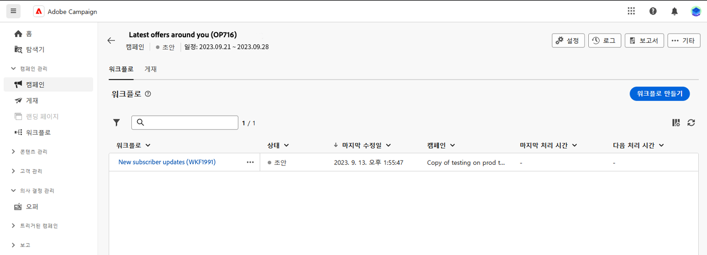

# 워크플로우를 만드는 핵심 원칙 {#gs-workflow-creation}

Adobe Campaign Web에서는 워크플로우를 시각적 캔버스에 작성하여 세분화, 캠페인 실행, 파일 처리 등 크로스 채널 프로세스를 디자인할 수 있습니다.

## 워크플로 내부에는 무엇이 있습니까? {#gs-workflow-inside}

워크플로 다이어그램은 어떤 일이 발생할지를 나타냅니다. 앞으로 수행할 다양한 작업과 이러한 작업이 어떻게 서로 연결되어 있는지 설명합니다.

{zoomable=&quot;yes&quot;} {zoomable=&quot;yes&quot;}

각 워크플로에는 다음이 포함됩니다.

* **활동**: 활동은 수행할 작업입니다. 다양한 활동이 다이어그램에 아이콘으로 표시됩니다. 각 활동에는 특정 속성과 모든 활동에 공통되는 다른 속성이 있습니다.

  워크플로 다이어그램에서 지정된 활동은 특히 루프 또는 반복 작업이 있는 경우 여러 작업을 생성할 수 있습니다.

* **전환**: 전환은 원본 활동을 대상 활동에 연결하고 해당 시퀀스를 정의합니다.

* **작업 테이블**: 작업 테이블에는 전환에 의해 전달되는 모든 정보가 포함됩니다. 각 워크플로는 여러 작업 테이블을 사용합니다. 이러한 테이블에 전달된 데이터는 워크플로의 수명 주기 전체에서 사용될 수 있습니다.

## 워크플로 생성 주요 단계 {#gs-workflow-steps}

캠페인에서는 워크플로를 만드는 두 가지 방법을 제공합니다.

1. 워크플로는 **워크플로** 메뉴에서 독립형 워크플로로 생성할 수 있습니다.

   {zoomable=&quot;yes&quot;}

1. 워크플로는 캠페인의 **워크플로** 탭을 통해 직접 캠페인 내에서 만들 수 있습니다. 캠페인에 포함되면 워크플로는 다른 모든 캠페인의 워크플로와 함께 실행되며 보고 지표는 모두 캠페인 수준에서 그룹화됩니다.

   {zoomable=&quot;yes&quot;}

워크플로우를 만드는 주요 단계는 다음과 같습니다.

{zoomable=&quot;yes&quot;}

이러한 단계는 다음 섹션에 자세히 설명되어 있습니다.

1. [워크플로 생성 및 속성 정의](create-workflow.md)
1. [활동 조율 및 구성](orchestrate-activities.md)
1. [워크플로 고급 설정 구성](workflow-settings.md)
1. [워크플로를 시작하고 실행을 모니터링](start-monitor-workflows.md)
