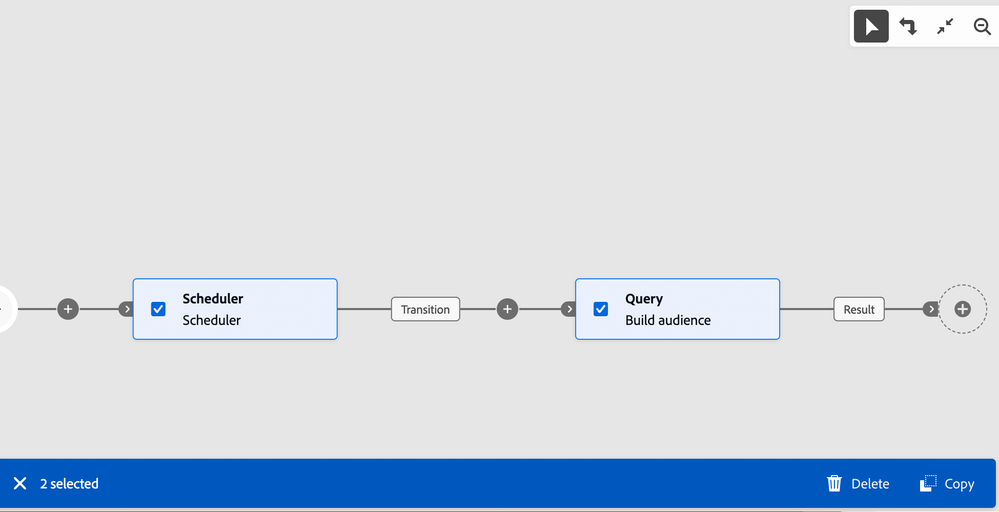

# 활동 조율 {#orchestrate}

[워크플로우를 만든](create-workflow.md)후에는 워크플로우 메뉴에서든 캠페인 내에서든 다른 작업을 조정할 수 있습니다. 이를 위해 워크플로 다이어그램을 구성할 수 있는 시각적 캔버스가 제공됩니다. 이 다이어그램 내에서 다양한 활동을 추가하고 순차적 순서로 연결할 수 있습니다.

## 활동 추가 {#add}

구성의 이 단계에서 다이어그램은 워크플로우의 시작을 나타내는 시작 아이콘과 함께 표시됩니다. 첫 번째 활동을 추가하려면 시작 아이콘에 연결된 **+** 단추를 클릭합니다.

다이어그램에 추가할 수 있는 활동 목록이 나타납니다. 사용 가능한 활동은 워크플로우 다이어그램 내의 위치에 따라 다릅니다. 예를 들어 첫 번째 활동을 추가할 때 대상을 타겟팅하거나, 워크플로 경로를 분할하거나, **대기** 활동을 설정하여 워크플로 실행을 지연시킬 수 있습니다. **대상자 만들기** 활동 후에 타깃팅 활동을 통해 대상을 세분화하거나, 채널 활동을 통해 대상자에게 게재를 보내거나, 흐름 제어 활동을 통해 워크플로우 프로세스를 구성할 수 있습니다.

{zoomable="yes"}

활동이 다이어그램에 추가되면 특정 설정으로 새로 추가된 활동을 구성할 수 있는 오른쪽 창이 나타납니다. 각 활동을 구성하는 방법에 대한 자세한 내용은 [이 섹션](activities/about-activities.md)에서 확인할 수 있습니다.

{zoomable="yes"}

이 프로세스를 반복하여 워크플로우가 수행하는 작업에 따라 필요한 만큼 활동을 추가합니다. 두 활동 사이에 새 활동을 삽입할 수도 있습니다. 이렇게 하려면 활동 간 전환에서 **+** 단추를 클릭하고 원하는 활동을 선택한 다음 오른쪽 창에서 구성합니다.

활동을 제거하려면 캔버스에서 활동을 선택하고 활동 속성에서 **삭제** 아이콘을 클릭하십시오.

>[!TIP]
>
>각 활동 간 전환의 이름을 개인화할 수 있습니다. 이렇게 하려면 전환을 선택하고 오른쪽 창에서 해당 레이블을 변경합니다.

## 도구 모음 {#toolbar}

캔버스의 오른쪽 위 모서리에 있는 도구 모음은 활동을 쉽게 조작하고 캔버스에서 탐색할 수 있는 옵션을 제공합니다.

* **여러 선택 모드**: 여러 활동을 선택하여 한꺼번에 삭제하거나 복사하여 붙여 넣으십시오. [이 섹션](#copy)을 참조하십시오.
* **회전**: 캔버스를 세로로 전환합니다.
* **화면에 맞춤**: 캔버스 확대/축소 수준을 화면에 맞춥니다.
* **축소** / **확대**: 캔버스를 축소하거나 확대합니다.
* **맵 표시**: 위치를 표시하는 캔버스의 스냅숏을 엽니다.

{zoomable="yes"}{width="50%"}

## 활동 관리 {#manage}

활동을 추가할 때 속성 창에서 작업 버튼을 사용할 수 있으므로 여러 작업을 수행할 수 있습니다.

{zoomable="yes"}

다음을 수행할 수 있습니다.

* 캔버스에서 활동을 **삭제**&#x200B;합니다.
* 활동을 **사용 안 함/사용**&#x200B;합니다. 워크플로우가 실행되면 비활성화된 활동과 동일한 경로의 다음 활동이 실행되지 않고 워크플로우가 중지됩니다.
* 활동을 **일시 중지/다시 시작**&#x200B;합니다. 워크플로우가 실행되면 일시 중지된 활동에서 일시 중지됩니다. 동일한 경로에서 해당 작업을 따르는 모든 작업은 실행되지 않습니다.
* 활동을 **복사**&#x200B;합니다. [이 섹션](#copy)을 참조하십시오.
* **활동 및 모든 하위 노드를 다른 전환으로 이동**&#x200B;합니다. [이 섹션](#move)을 참조하십시오.
* 활동의 **실행 옵션**&#x200B;에 액세스합니다.
* 활동의 **로그 및 작업**&#x200B;에 액세스합니다.

**결합** 또는 **중복 제거**&#x200B;와 같은 여러 **타깃팅** 활동을 사용하면 나머지 모집단을 처리하고 추가 아웃바운드 전환에 포함할 수 있습니다. 예를 들어, **Split** 활동을 사용하는 경우, 보수는 이전에 정의된 하위 집합과 일치하지 않는 모집단으로 구성됩니다. 이 기능을 사용하려면 **보조 항목 생성** 옵션을 활성화하세요.

## 활동 이동 또는 복사 {#move-copy}

### 활동 복사/붙여넣기 {#copy}

워크플로우 활동을 복사하여 모든 워크플로우에 붙여넣을 수 있습니다. 대상 워크플로우는 다른 브라우저 탭에 있을 수 있습니다.

활동을 복사하려면 두 가지 선택 사항이 있습니다.

* 작업 버튼을 사용하여 하나의 활동을 복사합니다.

  {zoomable="yes"}{width="70%"}

* 도구 모음 버튼을 사용하여 여러 활동을 복사합니다.

  {zoomable="yes"}{width="70%"}

복사된 활동을 붙여넣으려면 전환에서 **+** 단추를 클릭하고 &quot;X 활동 붙여넣기&quot;를 선택합니다.

{zoomable="yes"}{width="50%"}

### 활동 및 하위 노드 이동 {#move}

Journey Optimizer을 사용하면 활동을 하위 노드의 전체 콘텐츠(모든 전환 및 해당 내의 활동 포함)와 함께 동일한 워크플로우 내의 다른 전환 끝으로 이동할 수 있습니다.

이 프로세스는 초기 위치에서 아웃바운드 전환의 모든 항목과 활동의 연결을 끊고 새 타겟 전환으로 이동합니다.

활동을 이동하려면 다음을 수행합니다.

1. 이동할 활동을 선택합니다.
1. 활동의 속성 창에서 **이동** 단추를 클릭합니다.
1. 활동과 해당 아웃바운드 전환을 배치할 전환을 선택한 다음 확인합니다.

## 실행 옵션 {#execution}

모든 활동을 통해 실행 옵션을 관리할 수 있습니다. 활동을 선택하고 **실행 옵션** 단추를 클릭합니다. 이를 통해 오류 발생 시 활동의 실행 모드와 비헤이비어를 정의할 수 있습니다.

{zoomable="yes"}{width="70%"}

### 속성

**실행** 필드를 사용하면 작업이 시작될 때 수행할 작업을 정의할 수 있습니다.

**최대 실행 기간** 필드를 사용하면 &quot;30초&quot; 또는 &quot;1시간&quot;과 같은 기간을 지정할 수 있습니다. 지정된 기간 후에 활동이 완료되지 않으면 경고가 트리거됩니다. 이는 워크플로의 작동 방식에는 영향을 주지 않습니다.

**시간대** 필드를 사용하면 활동의 시간대를 선택할 수 있습니다. Adobe Campaign은 동일한 인스턴스에서 여러 국가 간의 시간 차이를 관리합니다. 적용된 설정은 인스턴스가 생성될 때 구성됩니다.

**선호도** 필드를 사용하면 워크플로 또는 워크플로 활동을 특정 컴퓨터에서 강제로 실행할 수 있습니다. 이렇게 하려면 해당 워크플로우 또는 활동에 대해 하나 또는 여러 선호도를 지정합니다.

**Behavior** 필드를 사용하면 비동기 작업이 사용되는 경우 따라야 할 프로시저를 정의할 수 있습니다.

### 오류 관리

**오류가 발생한 경우** 필드를 사용하면 활동에 오류가 발생할 경우 수행할 작업을 지정할 수 있습니다.

### 초기화 스크립트

**초기화 스크립트**&#x200B;를 사용하여 변수를 초기화하거나 활동 속성을 수정할 수 있습니다. **코드 편집** 단추를 클릭하고 실행할 코드 조각을 입력하십시오. 활동이 실행될 때 스크립트가 호출됩니다. [이벤트 변수](../workflows/event-variables.md)와 관련된 섹션을 참조하세요.

## 예제 {#example}

다음은 커피 머신에 관심이 있는 모든 고객(VIP 고객 제외)에게 이메일을 보내도록 설계된 워크플로우 예입니다.

{zoomable="yes"}

이를 위해 다음 활동이 추가되었습니다.

* 워크플로우를 세 개의 경로(각 고객 집합에 대해 하나)로 나누는 **[!UICONTROL 포크]** 활동,
* 다음 세 고객 집합을 대상으로 하는 **[!UICONTROL 대상 만들기]** 활동:
   * 이메일이 있는 고객,
   * 기존 &quot;커피 머신에 관심 있음&quot; 대상에 속하는 고객,
   * 기존 &quot;보상하려는 VIP&quot; 대상에 속하는 고객.
* 전자 메일을 통해 고객과 커피 머신에 관심이 있는 고객을 함께 그룹화하는 **[!UICONTROL 결합]** 활동
* VIP 고객을 제외하는 **[!UICONTROL 결합]** 활동,
* 최종 고객에게 이메일을 보내는 **[!UICONTROL 이메일 게재]** 활동.

워크플로우를 완료하면 다이어그램의 끝에 **[!UICONTROL End]** 활동을 추가합니다. 이 활동은 워크플로우의 끝을 시각적으로 표시하며 기능에는 영향을 주지 않습니다.

워크플로우 다이어그램을 성공적으로 디자인한 후 워크플로우를 실행하고 다양한 작업의 진행 상황을 추적합니다. [워크플로우를 시작하고 실행을 모니터링하는 방법을 알아봅니다](start-monitor-workflows.md).