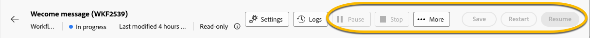

# 읽기 전용 워크플로 정보 {#readonly-workflows}

>[!CONTEXTUALHELP]
>id="acw_wf_read_only_canvas"
>title="이 워크플로는 읽기 전용입니다."
>abstract="귀하의 권리 또는 워크플로 유형으로 인해 이 워크플로를 편집할 수 없습니다."

일부 워크플로우는 읽기 전용입니다. 기본 제공 기술 워크플로우는 항상 읽기 전용이지만 다른 유형의 워크플로에도 이 제한이 적용될 수 있습니다.

Campaign 사용자는 Adobe Campaign 데이터에 대한 액세스가 제한될 수 있습니다. Campaign 관리자는 사용자에게 특정 기능을 볼 수 있는 권한을 부여할 수 있지만 편집하거나 수정할 수는 없습니다. 데이터와 프로세스 보안을 보장하기 위해서는 데이터에 대한 사용자 권한이 필수적입니다. [이 섹션](../get-started/permissions.md)에서 Campaign의 권한 관리에 대해 자세히 알아보세요.

워크플로우가 읽기 전용 모드에 있는 경우:

* **[!UICONTROL 읽기 전용]** 언급이 **[!UICONTROL 설정]** 단추 근처에 나타납니다.
* 작업 버튼에 액세스할 수 없습니다.

{zoomable="yes"}

읽기 전용 워크플로우에서는 어떤 것도 편집할 수 없습니다. 활동의 설정을 변경할 수 없습니다.

{zoomable="yes"}

사용자는 워크플로우를 삭제할 수 없습니다.

{zoomable="yes"}

## 읽기 전용 워크플로 유형 {#readonly-workflow-types}

워크플로우 유형에 따라 읽기 전용 모드가 달라질 수 있습니다.

### 캠페인 워크플로 {#readonly-campaign-wf}

읽기 전용 캠페인 워크플로우에서는 모니터링 버튼에 액세스할 수 없습니다.

{zoomable="yes"}

### 기술 워크플로 {#readonly-tech-wf}

기본 제공 기술 워크플로우는 관리자를 비롯한 모든 Campaign 사용자를 위해 읽기 전용입니다. 그러나 필요한 경우 사용자는 **일시 중지**&#x200B;하거나 **중지**&#x200B;할 수 있습니다. 허용되는 작업은 이것뿐입니다.

{zoomable="yes"}

[이 섹션](https://experienceleague.adobe.com/ko/docs/campaign/automation/workflows/introduction/wf-type/technical-workflows)에서 기술 워크플로우에 대해 자세히 알아보세요.